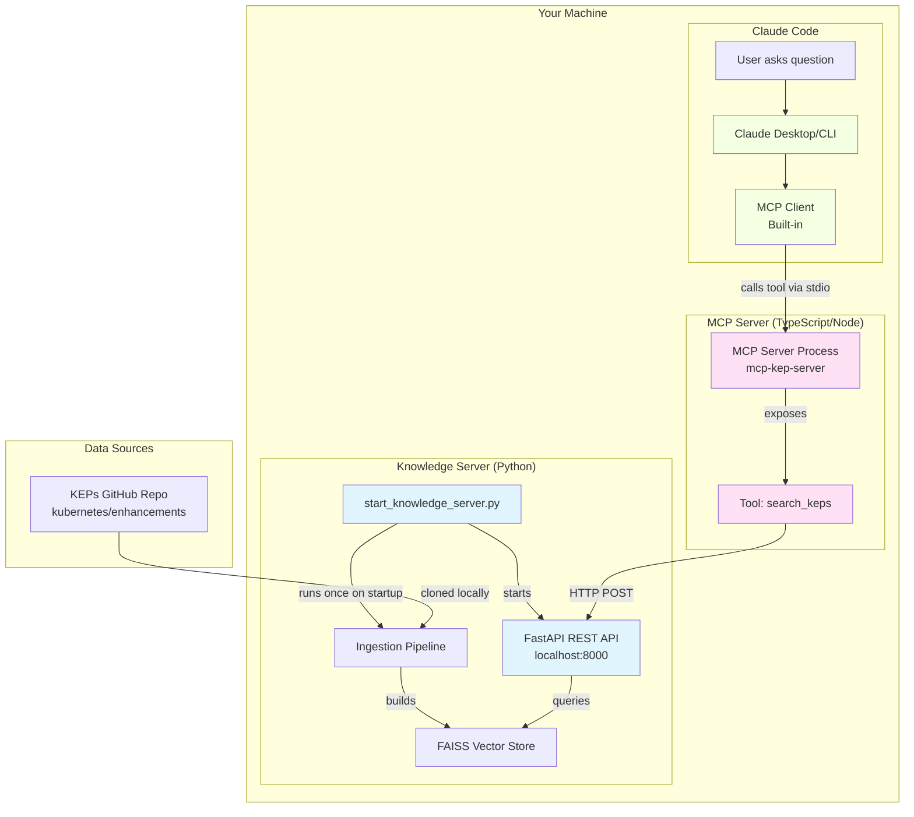
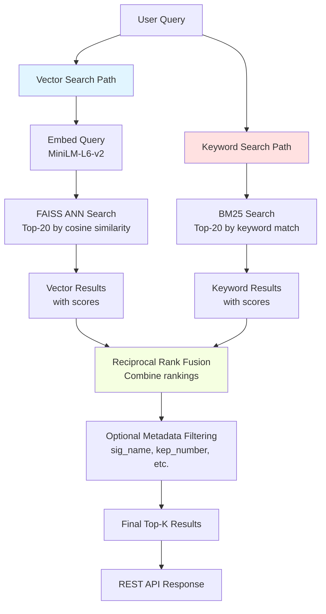
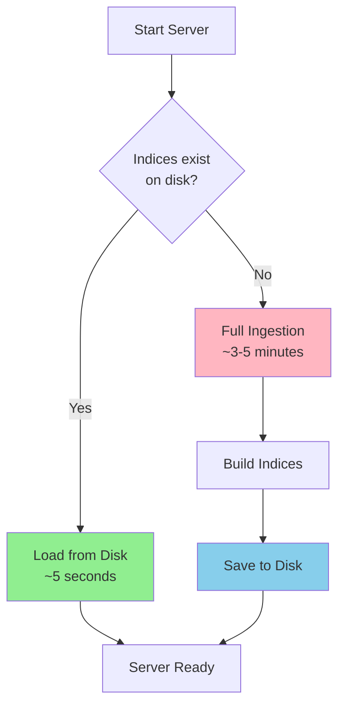

# High-Level Plan: KEP Knowledge Server with MCP Integration

## Architecture Overview

This project consists of **two separate systems** that work together:



### Component Breakdown

#### 1️⃣ Knowledge Server (Python Backend) - **BUILD THIS FIRST**
- **What:** Standalone FastAPI service
- **Purpose:** Ingest, index, and search KEP documents using **hybrid search** (vector + keyword)
- **Technology:** Python, FastAPI, FAISS, BM25, sentence-transformers
- **API:** REST endpoints on `localhost:8000`
- **Reusability:** Can be used by any tool (MCP, CLI, M365 Copilot, etc.)

#### Hybrid Search Architecture

The Knowledge Server implements **hybrid search** combining semantic vector search with keyword-based BM25:



**Why Hybrid Search?**
- **Vector search** captures semantic meaning ("CRD versioning" matches "custom resource definition version management")
- **Keyword search** ensures exact term matches ("sig-api-machinery" finds the right SIG)
- **Fusion** combines both strengths using Reciprocal Rank Fusion (RRF)
- **Result:** Better recall and precision than either method alone

#### 2️⃣ MCP Server (TypeScript Wrapper) - **BUILD THIS SECOND**
- **What:** Thin adapter implementing Model Context Protocol
- **Purpose:** Translate between Claude Code and your Knowledge Server
- **Technology:** TypeScript/Node.js
- **Communication:** stdio with Claude Code, HTTP with Knowledge Server
- **Size:** ~50-100 lines of code

#### 3️⃣ MCP Client (Built into Claude Code) - **YOU DON'T BUILD THIS**
- **What:** Built-in component of Claude Code/Claude Desktop
- **Purpose:** Manages MCP servers and makes tools available to Claude
- **Configuration:** You only provide JSON config telling it how to start your MCP server

### The Complete Flow

```
1. User asks: "How does Kubernetes handle CRD versioning?"
   ↓
2. Claude Code (with built-in MCP client) thinks: "I should search the KEPs"
   ↓
3. MCP Client calls the search_keps tool in your MCP Server (via stdio)
   ↓
4. Your MCP Server receives the tool call
   ↓
5. MCP Server makes HTTP request to Knowledge Server:
   POST http://localhost:8000/search
   { "query": "CRD versioning", "top_k": 5 }
   ↓
6. Knowledge Server (FastAPI):
   - Embeds the query using MiniLM-L6-v2
   - Searches FAISS index
   - Returns relevant KEP chunks with metadata
   ↓
7. MCP Server forwards results back to Claude Code
   ↓
8. Claude Code uses the context to answer the user with specific KEP references
```

---

## Understanding Persistence (Critical for Prototyping!)

**The system automatically persists all indices to disk** so you don't re-index on every startup:



**Persistence Locations:**
```
storage/
├── faiss_index/
│   └── index.faiss           # FAISS vector index (~50MB)
│                             # Contains: 5432 vectors × 384 dimensions
│                             # Format: Binary (FAISS native format)
│
├── bm25_index.pkl            # BM25 keyword index (~30MB)
│                             # Contains: Tokenized corpus + BM25 statistics
│                             # Format: Pickle (Python serialization)
│
└── metadata.json             # Chunk metadata (~10MB)
                              # Contains: All chunk text + KEP metadata
                              # Format: JSON (human-readable)
```

**What Gets Saved:**
1. **FAISS Index** (`index.faiss`)
   - All 384-dimensional embedding vectors
   - Index structure for fast similarity search
   - Binary format (not human-readable)

2. **BM25 Index** (`bm25_index.pkl`)
   - Tokenized document corpus
   - Term frequency statistics
   - Document length information
   - IDF (Inverse Document Frequency) scores

3. **Metadata** (`metadata.json`)
   - Original chunk text
   - KEP IDs, titles, SIG names
   - File paths and types
   - Chunk positions
   - Allows reconstruction without re-reading source files

**What Doesn't Get Saved:**
- ❌ Original KEP documents (stay in `data/enhancements/`)
- ❌ Embedder model (downloaded to `~/.cache/huggingface/`)
- ❌ API server state (stateless)

**Workflow:**
1. **First run:** Full ingestion takes 3-5 minutes, then saves indices to disk
2. **Subsequent runs:** Loads from disk in ~5 seconds (100x faster!)
3. **Force re-index:** Run `python start_knowledge_server.py --reindex`
4. **Perfect for prototyping:** Change API code, restart instantly with existing indices

**Key Benefits:**
- ✅ No re-indexing between server restarts
- ✅ Fast iteration on API/search logic
- ✅ Can delete `storage/` folder to start fresh
- ✅ Indices are portable (copy to another machine)

---

## Phase 1: Project Setup & Dependencies (Knowledge Server)

### 1.1 Initialize Project Structure
```
kep-knowledge-server/
├── docker-compose.yml
├── requirements.txt
├── .gitignore
├── README.md
├── start_knowledge_server.py          # Main entry point
├── config.py                           # Configuration constants
├── ingestion/
│   ├── __init__.py
│   ├── document_loader.py              # Walks KEPs repo, loads files
│   ├── text_extractor.py               # Extracts text from .md, .yaml, .txt
│   ├── chunker.py                      # Chunks documents intelligently
│   └── embedder.py                     # MiniLM-L6-v2 wrapper
├── vector_store/
│   ├── __init__.py
│   ├── faiss_store.py                  # FAISS vector index
│   ├── bm25_retriever.py               # BM25 keyword search
│   └── hybrid_store.py                 # Combines vector + keyword search
├── api/
│   ├── __init__.py
│   ├── server.py                       # FastAPI app
│   └── models.py                       # Pydantic request/response models
├── data/
│   └── enhancements/                   # Clone KEPs here
└── storage/
    ├── faiss_index/                    # Persisted FAISS index
    └── metadata.json                   # Document metadata store
```

### 1.2 Dependencies (requirements.txt)
```
fastapi==0.104.1
uvicorn==0.24.0
sentence-transformers==2.2.2
faiss-cpu==1.7.4
numpy==1.24.3
pydantic==2.5.0
python-multipart==0.0.6
pyyaml==6.0.1
markdown==3.5.1
aiofiles==23.2.1
gitpython==3.1.40
rank-bm25==0.2.2                        # BM25 for keyword search (hybrid)
```

### 1.3 Data Source
Clone the Kubernetes Enhancement Proposals repository:
```bash
git clone https://github.com/kubernetes/enhancements.git data/enhancements
```

**Why KEPs?**
- Directory-per-ID structure matches your real use case
- Multiple formats (markdown, yaml, images)
- Realistic technical architecture content
- Good size for testing (~hundreds of documents)

---

## Phase 2: Configuration & Constants

### 2.1 config.py
Define all configuration in one place:

```python
from pathlib import Path

# Paths
BASE_DIR = Path(__file__).parent
DATA_DIR = BASE_DIR / "data" / "enhancements"
STORAGE_DIR = BASE_DIR / "storage"
FAISS_INDEX_DIR = STORAGE_DIR / "faiss_index"
METADATA_PATH = STORAGE_DIR / "metadata.json"

# Model Configuration
EMBEDDING_MODEL = "sentence-transformers/all-MiniLM-L6-v2"
EMBEDDING_DIMENSION = 384  # MiniLM-L6-v2 output dimension

# Chunking Configuration
CHUNK_SIZE = 512  # tokens
CHUNK_OVERLAP = 50  # tokens

# API Configuration
API_HOST = "0.0.0.0"
API_PORT = 8000

# KEPs Configuration
KEPS_REPO_URL = "https://github.com/kubernetes/enhancements.git"
KEPS_BASE_PATH = "keps"  # subdirectory within repo
SUPPORTED_FILE_TYPES = [".md", ".yaml", ".txt"]
```

---

## Phase 3: Document Ingestion Pipeline

### 3.1 document_loader.py
**Purpose:** Walk the KEPs directory structure and discover documents

**Key Classes:**
```python
from dataclasses import dataclass
from pathlib import Path
from typing import List

@dataclass
class KEPDocument:
    """Represents a single KEP document"""
    kep_id: str              # e.g., "sig-api-machinery/0001"
    file_path: Path          # Full path to file
    file_type: str           # .md, .yaml, .txt
    sig_name: str            # e.g., "sig-api-machinery"
    kep_number: str          # e.g., "0001"
    title: str               # Extracted from file if possible
    file_size: int           # Size in bytes
```

**Key Functions:**
```python
def discover_keps(base_path: Path) -> List[KEPDocument]:
    """
    Walk through keps/ directory structure
    
    Expected structure:
    keps/
      sig-api-machinery/
        0001-component-config/
          README.md
          kep.yaml
      sig-apps/
        0002-cron-jobs/
          README.md
    
    Returns:
        List of KEPDocument objects with extracted metadata
    """
    
def extract_title_from_file(file_path: Path, file_type: str) -> str:
    """
    Extract title from document:
    - For .md: First # heading
    - For .yaml: Look for 'title' field
    - For .txt: First non-empty line
    """
```

### 3.2 text_extractor.py
**Purpose:** Extract clean text from different file formats

**Key Functions:**
```python
def extract_text(file_path: Path, file_type: str) -> str:
    """
    Extract text content from various file types
    
    Strategies:
    - .md: Read as markdown, preserve structure (headers, lists)
    - .yaml: Convert to readable text format (key: value pairs)
    - .txt: Read as-is with encoding detection
    
    Handles:
    - Encoding issues (try utf-8, then latin-1, then ignore errors)
    - Binary files (skip)
    - Empty files (return empty string)
    
    Returns:
        Clean text string ready for chunking
    """

def clean_markdown(text: str) -> str:
    """
    Light cleaning of markdown:
    - Remove excessive whitespace
    - Normalize line endings
    - Keep headers and structure intact
    """

def yaml_to_text(yaml_content: dict) -> str:
    """
    Convert YAML structure to readable text
    Example:
    {
      "title": "Component Config",
      "status": "implemented"
    }
    →
    "Title: Component Config
     Status: implemented"
    """
```

### 3.3 chunker.py
**Purpose:** Split documents into semantically meaningful chunks

**Key Classes:**
```python
@dataclass
class Chunk:
    """Represents a chunk of text with metadata"""
    chunk_id: str            # Unique ID: {kep_id}_{chunk_index}
    text: str                # The actual text content
    kep_id: str              # Parent KEP ID
    chunk_index: int         # Position in document (0-indexed)
    metadata: dict           # All KEP metadata (sig_name, title, etc.)
```

**Key Functions:**
```python
def chunk_document(
    text: str, 
    doc_metadata: dict, 
    chunk_size: int = 512, 
    overlap: int = 50
) -> List[Chunk]:
    """
    Split document into overlapping chunks with smart boundaries
    
    Strategy:
    1. Split on markdown headers first (##, ###, ####)
       - Each section becomes a candidate chunk
    2. If sections too large, split on paragraph breaks (\n\n)
    3. If still too large, split on sentence boundaries
    4. Add overlap between chunks to maintain context
    
    Why overlap?
    - Prevents losing context at boundaries
    - Example: If chunk 1 ends mid-concept, chunk 2 starts with overlap
    
    Returns:
        List of Chunk objects with metadata preserved
    """

def split_by_headers(text: str) -> List[str]:
    """Split markdown by headers, keeping header with content"""

def split_by_paragraphs(text: str, max_size: int) -> List[str]:
    """Split on paragraph breaks if sections too large"""

def split_by_sentences(text: str, max_size: int) -> List[str]:
    """Final fallback: split on sentence boundaries"""

def add_overlap(chunks: List[str], overlap: int) -> List[str]:
    """Add overlapping text between consecutive chunks"""
```

### 3.4 embedder.py
**Purpose:** Generate embeddings using all-MiniLM-L6-v2

**Key Classes:**
```python
from sentence_transformers import SentenceTransformer
import numpy as np

class Embedder:
    """Wrapper around sentence-transformers for generating embeddings"""
    
    def __init__(self, model_name: str = "all-MiniLM-L6-v2"):
        """
        Initialize the embedding model
        
        all-MiniLM-L6-v2:
        - 384 dimensions
        - ~80MB model size
        - Fast inference (~5ms per sentence on CPU)
        - Good balance of speed and quality
        """
        print(f"Loading embedding model: {model_name}")
        self.model = SentenceTransformer(model_name)
        self.dimension = self.model.get_sentence_embedding_dimension()
    
    def embed_batch(
        self, 
        texts: List[str], 
        batch_size: int = 32,
        show_progress: bool = True
    ) -> np.ndarray:
        """
        Embed multiple texts in batches
        
        Args:
            texts: List of text strings to embed
            batch_size: Number of texts to process at once
            show_progress: Show progress bar
            
        Returns:
            numpy array of shape (len(texts), 384)
            
        Performance notes:
        - Batching is ~10x faster than one-by-one
        - Adjust batch_size based on available RAM
        - Progress bar uses tqdm
        """
        embeddings = self.model.encode(
            texts,
            batch_size=batch_size,
            show_progress_bar=show_progress,
            convert_to_numpy=True
        )
        return embeddings
    
    def embed_query(self, query: str) -> np.ndarray:
        """
        Embed a single query string
        
        Returns:
            numpy array of shape (384,)
        """
        embedding = self.model.encode(query, convert_to_numpy=True)
        return embedding
```

---

## Phase 4: Vector Store with FAISS

### 4.1 faiss_store.py
**Purpose:** Manage FAISS index for fast similarity search

**Key Classes:**
```python
import faiss
import json
import numpy as np
from typing import List, Dict
from dataclasses import asdict

@dataclass
class SearchResult:
    """Result from a similarity search"""
    chunk_id: str
    kep_id: str
    text: str
    score: float             # Similarity score (0-1 for cosine, unbounded for BM25)
    metadata: dict           # All KEP metadata
    chunk_index: int         # Position in original document

class FAISSStore:
    """
    Manages FAISS index and chunk metadata
    
    FAISS (Facebook AI Similarity Search):
    - Fast vector similarity search
    - IndexFlatIP for inner product (cosine similarity)
    - Can handle millions of vectors efficiently
    """
    
    def __init__(self, dimension: int = 384):
        """
        Initialize FAISS index
        
        Using IndexFlatIP (Inner Product):
        - Exact search (no approximation)
        - Works well for <1M vectors
        - For larger datasets, use IndexIVFFlat
        
        Note: Inner product with normalized vectors = cosine similarity
        """
        self.dimension = dimension
        self.index = faiss.IndexFlatIP(dimension)
        self.chunks: List[Chunk] = []
        self.chunk_map: Dict[str, int] = {}  # chunk_id -> index
        
    def add_embeddings(self, embeddings: np.ndarray, chunks: List[Chunk]):
        """
        Add embeddings to FAISS index
        
        Args:
            embeddings: numpy array of shape (n, 384)
            chunks: List of Chunk objects (same length as embeddings)
            
        Process:
        1. Normalize embeddings (for cosine similarity)
        2. Add to FAISS index
        3. Store chunk metadata separately (FAISS only stores vectors)
        """
        # Normalize for cosine similarity
        faiss.normalize_L2(embeddings)
        
        # Add to index
        self.index.add(embeddings)
        
        # Store chunks and create lookup map
        start_idx = len(self.chunks)
        self.chunks.extend(chunks)
        for i, chunk in enumerate(chunks):
            self.chunk_map[chunk.chunk_id] = start_idx + i
    
    def search(
        self, 
        query_embedding: np.ndarray, 
        top_k: int = 5,
        min_score: float = 0.0
    ) -> List[SearchResult]:
        """
        Search for most similar chunks
        
        Args:
            query_embedding: numpy array of shape (384,)
            top_k: Number of results to return
            min_score: Minimum similarity score (0-1)
            
        Returns:
            List of SearchResult objects, sorted by score (descending)
            
        Process:
        1. Normalize query embedding
        2. Search FAISS index
        3. Filter by min_score
        4. Attach chunk metadata
        """
        # Normalize query
        query_embedding = query_embedding.reshape(1, -1).astype('float32')
        faiss.normalize_L2(query_embedding)
        
        # Search
        scores, indices = self.index.search(query_embedding, top_k)
        
        # Build results
        results = []
        for score, idx in zip(scores[0], indices[0]):
            if score < min_score:
                continue
                
            chunk = self.chunks[idx]
            results.append(SearchResult(
                chunk_id=chunk.chunk_id,
                kep_id=chunk.kep_id,
                text=chunk.text,
                score=float(score),
                metadata=chunk.metadata,
                chunk_index=chunk.chunk_index
            ))
        
        return results
    
    def save(self, index_path: Path, metadata_path: Path):
        """
        Persist index and metadata to disk
        
        Saves:
        - FAISS index (binary format)
        - Chunk metadata (JSON)
        """
        index_path.parent.mkdir(parents=True, exist_ok=True)
        metadata_path.parent.mkdir(parents=True, exist_ok=True)
        
        # Save FAISS index
        faiss.write_index(self.index, str(index_path))
        
        # Save metadata
        metadata = {
            'chunks': [asdict(chunk) for chunk in self.chunks],
            'chunk_map': self.chunk_map,
            'dimension': self.dimension
        }
        with open(metadata_path, 'w') as f:
            json.dump(metadata, f, indent=2)
    
    def load(self, index_path: Path, metadata_path: Path):
        """
        Load previously saved index and metadata
        
        Allows fast restart without re-ingestion
        """
        # Load FAISS index
        self.index = faiss.read_index(str(index_path))
        
        # Load metadata
        with open(metadata_path, 'r') as f:
            metadata = json.load(f)
        
        self.chunks = [Chunk(**chunk_dict) for chunk_dict in metadata['chunks']]
        self.chunk_map = metadata['chunk_map']
        self.dimension = metadata['dimension']
    
    def get_stats(self) -> dict:
        """Return statistics about the index"""
        return {
            'total_chunks': len(self.chunks),
            'total_vectors': self.index.ntotal,
            'dimension': self.dimension,
            'unique_keps': len(set(chunk.kep_id for chunk in self.chunks))
        }
```

---

## Phase 4.5: BM25 Keyword Search

### 4.5.1 bm25_retriever.py
**Purpose:** Implement keyword-based search using BM25 algorithm

**Key Classes:**
```python
from rank_bm25 import BM25Okapi
import numpy as np
from typing import List
import re

class BM25Retriever:
    """
    BM25 (Best Matching 25) keyword search
    
    BM25 is a probabilistic ranking function that:
    - Considers term frequency (TF)
    - Considers inverse document frequency (IDF)
    - Accounts for document length normalization
    - Better than TF-IDF for information retrieval
    
    Great for:
    - Exact term matching ("sig-api-machinery")
    - Technical terms and identifiers
    - When semantic meaning is less important than exact wording
    """
    
    def __init__(self):
        self.corpus_tokens: List[List[str]] = []
        self.chunks: List[Chunk] = []
        self.bm25: BM25Okapi = None
    
    def _tokenize(self, text: str) -> List[str]:
        """
        Tokenize text for BM25
        
        Strategy:
        - Lowercase
        - Split on whitespace and punctuation
        - Keep hyphenated terms intact (sig-api-machinery)
        - Remove very short tokens (<2 chars)
        """
        # Lowercase and split on whitespace/punctuation, keeping hyphens
        tokens = re.findall(r'\b[\w-]+\b', text.lower())
        
        # Filter out very short tokens
        tokens = [t for t in tokens if len(t) >= 2]
        
        return tokens
    
    def add_chunks(self, chunks: List[Chunk]):
        """
        Build BM25 index from chunks
        
        Args:
            chunks: List of Chunk objects to index
            
        Process:
        1. Tokenize each chunk's text
        2. Build BM25Okapi index
        3. Store chunks for retrieval
        """
        self.chunks = chunks
        self.corpus_tokens = [self._tokenize(chunk.text) for chunk in chunks]
        self.bm25 = BM25Okapi(self.corpus_tokens)
        
        print(f"   ✓ BM25 index built with {len(chunks)} documents")
    
    def search(self, query: str, top_k: int = 20) -> List[SearchResult]:
        """
        Search using BM25 keyword matching
        
        Args:
            query: Search query string
            top_k: Number of results to return
            
        Returns:
            List of SearchResult objects, sorted by BM25 score (descending)
            
        Note: BM25 scores are unbounded (not 0-1 like cosine similarity)
        """
        if self.bm25 is None:
            raise ValueError("BM25 index not built. Call add_chunks() first.")
        
        # Tokenize query
        query_tokens = self._tokenize(query)
        
        # Get BM25 scores for all documents
        scores = self.bm25.get_scores(query_tokens)
        
        # Get top-k indices
        top_indices = np.argsort(scores)[-top_k:][::-1]
        
        # Build results
        results = []
        for idx in top_indices:
            score = scores[idx]
            if score <= 0:  # Skip documents with no matching terms
                continue
                
            chunk = self.chunks[idx]
            results.append(SearchResult(
                chunk_id=chunk.chunk_id,
                kep_id=chunk.kep_id,
                text=chunk.text,
                score=float(score),
                metadata=chunk.metadata,
                chunk_index=chunk.chunk_index
            ))
        
        return results
    
    def save(self, bm25_path: Path):
        """
        Save BM25 index to disk
        
        Saves:
        - Tokenized corpus
        - Chunks (for reconstruction)
        """
        import pickle
        
        bm25_path.parent.mkdir(parents=True, exist_ok=True)
        
        with open(bm25_path, 'wb') as f:
            pickle.dump({
                'corpus_tokens': self.corpus_tokens,
                'chunks': self.chunks,
                'bm25': self.bm25
            }, f)
    
    def load(self, bm25_path: Path):
        """Load BM25 index from disk"""
        import pickle
        
        with open(bm25_path, 'rb') as f:
            data = pickle.load(f)
        
        self.corpus_tokens = data['corpus_tokens']
        self.chunks = data['chunks']
        self.bm25 = data['bm25']
```

### 4.5.2 hybrid_store.py
**Purpose:** Combine vector and keyword search with Reciprocal Rank Fusion

**Key Classes:**
```python
from collections import defaultdict
from typing import List, Optional, Dict
import numpy as np
from pathlib import Path

class HybridSearchStore:
    """
    Hybrid search combining FAISS vector search and BM25 keyword search
    
    Search modes:
    - 'vector': Pure semantic search using embeddings
    - 'keyword': Pure BM25 keyword search
    - 'hybrid': Combines both using Reciprocal Rank Fusion (RRF)
    
    RRF (Reciprocal Rank Fusion):
    - Combines multiple ranked lists
    - Formula: score = sum(1 / (k + rank)) across all lists
    - k is typically 60 (research-backed constant)
    - Works well even when score magnitudes differ
    """
    
    def __init__(self, dimension: int = 384):
        self.faiss_store = FAISSStore(dimension)
        self.bm25_retriever = BM25Retriever()
        self.dimension = dimension
    
    def add_embeddings(self, embeddings: np.ndarray, chunks: List[Chunk]):
        """
        Add documents to both vector and keyword indices
        
        Args:
            embeddings: Vector embeddings for chunks
            chunks: Document chunks with text and metadata
        """
        # Add to vector store
        self.faiss_store.add_embeddings(embeddings, chunks)
        
        # Add to BM25 index
        self.bm25_retriever.add_chunks(chunks)
    
    def search(
        self,
        query_text: str,
        query_embedding: Optional[np.ndarray] = None,
        search_type: str = "hybrid",
        top_k: int = 5,
        filters: Optional[Dict] = None,
        min_score: float = 0.0
    ) -> List[SearchResult]:
        """
        Search using specified strategy
        
        Args:
            query_text: The search query string
            query_embedding: Pre-computed query embedding (required for vector/hybrid)
            search_type: 'vector', 'keyword', or 'hybrid'
            top_k: Number of results to return
            filters: Metadata filters (e.g., {'sig_name': 'sig-api-machinery'})
            min_score: Minimum score threshold (after fusion for hybrid)
            
        Returns:
            List of SearchResult objects
            
        Examples:
            # Pure vector search
            results = store.search(
                query_text="CRD versioning",
                query_embedding=embedder.embed_query("CRD versioning"),
                search_type="vector",
                top_k=5
            )
            
            # Hybrid search with filtering
            results = store.search(
                query_text="authentication",
                query_embedding=embedder.embed_query("authentication"),
                search_type="hybrid",
                filters={'sig_name': 'sig-auth'}
            )
        """
        
        if search_type == "vector":
            if query_embedding is None:
                raise ValueError("query_embedding required for vector search")
            results = self.faiss_store.search(query_embedding, top_k=top_k)
        
        elif search_type == "keyword":
            results = self.bm25_retriever.search(query_text, top_k=top_k)
        
        elif search_type == "hybrid":
            if query_embedding is None:
                raise ValueError("query_embedding required for hybrid search")
            
            # Get candidates from both methods (fetch more for better fusion)
            candidate_k = top_k * 4  # Fetch 4x for better fusion quality
            
            vector_results = self.faiss_store.search(
                query_embedding, 
                top_k=candidate_k
            )
            keyword_results = self.bm25_retriever.search(
                query_text, 
                top_k=candidate_k
            )
            
            # Reciprocal Rank Fusion
            results = self._reciprocal_rank_fusion(
                vector_results,
                keyword_results,
                k=60  # Standard RRF constant
            )
            
            # Take top-k after fusion
            results = results[:top_k]
        
        else:
            raise ValueError(f"Invalid search_type: {search_type}")
        
        # Apply metadata filters if provided
        if filters:
            results = self._apply_filters(results, filters)
        
        # Apply minimum score filter
        if min_score > 0:
            results = [r for r in results if r.score >= min_score]
        
        return results
    
    def _reciprocal_rank_fusion(
        self,
        results1: List[SearchResult],
        results2: List[SearchResult],
        k: int = 60
    ) -> List[SearchResult]:
        """
        Combine rankings using Reciprocal Rank Fusion (RRF)
        
        RRF formula: score(d) = sum over all rankings r of: 1 / (k + rank_r(d))
        
        Where:
        - d = document
        - k = constant (typically 60)
        - rank_r(d) = rank of document d in ranking r
        
        Benefits:
        - No need to normalize scores from different methods
        - Robust to outliers
        - Simple and effective
        
        Args:
            results1: Ranked list from first retriever (e.g., vector)
            results2: Ranked list from second retriever (e.g., BM25)
            k: RRF constant (60 is research-backed default)
            
        Returns:
            Merged and re-ranked results
        """
        
        # Build lookup maps
        all_chunks: Dict[str, SearchResult] = {}
        scores: Dict[str, float] = defaultdict(float)
        
        # Add scores from first ranking (vector search)
        for rank, result in enumerate(results1):
            chunk_id = result.chunk_id
            all_chunks[chunk_id] = result
            scores[chunk_id] += 1.0 / (k + rank + 1)  # rank is 0-indexed
        
        # Add scores from second ranking (keyword search)
        for rank, result in enumerate(results2):
            chunk_id = result.chunk_id
            if chunk_id not in all_chunks:
                all_chunks[chunk_id] = result
            scores[chunk_id] += 1.0 / (k + rank + 1)
        
        # Sort by combined RRF score (descending)
        sorted_ids = sorted(scores.items(), key=lambda x: x[1], reverse=True)
        
        # Rebuild results with RRF scores
        fused_results = []
        for chunk_id, rrf_score in sorted_ids:
            result = all_chunks[chunk_id]
            # Replace original score with RRF score
            result.score = rrf_score
            fused_results.append(result)
        
        return fused_results
    
    def _apply_filters(
        self,
        results: List[SearchResult],
        filters: Dict
    ) -> List[SearchResult]:
        """
        Filter results by metadata
        
        Args:
            results: Search results to filter
            filters: Dictionary of metadata filters
                     e.g., {'sig_name': 'sig-api-machinery', 'file_type': '.md'}
                     
        Returns:
            Filtered results
        """
        filtered = []
        for result in results:
            match = True
            for key, value in filters.items():
                if result.metadata.get(key) != value:
                    match = False
                    break
            if match:
                filtered.append(result)
        
        return filtered
    
    def save(
        self,
        faiss_index_path: Path,
        metadata_path: Path,
        bm25_path: Path
    ):
        """
        Persist all indices to disk
        
        Saves:
        - FAISS vector index
        - Chunk metadata
        - BM25 keyword index
        """
        self.faiss_store.save(faiss_index_path, metadata_path)
        self.bm25_retriever.save(bm25_path)
    
    def load(
        self,
        faiss_index_path: Path,
        metadata_path: Path,
        bm25_path: Path
    ):
        """Load all indices from disk"""
        self.faiss_store.load(faiss_index_path, metadata_path)
        self.bm25_retriever.load(bm25_path)
    
    def get_stats(self) -> dict:
        """Return statistics about both indices"""
        faiss_stats = self.faiss_store.get_stats()
        return {
            **faiss_stats,
            'search_modes': ['vector', 'keyword', 'hybrid'],
            'fusion_algorithm': 'Reciprocal Rank Fusion (RRF)'
        }
```

---

## Phase 5: REST API with FastAPI

### 5.1 models.py
**Purpose:** Pydantic models for request/response validation

```python
from pydantic import BaseModel, Field
from typing import List, Optional, Dict, Literal

class SearchRequest(BaseModel):
    """Request model for search endpoint"""
    query: str = Field(..., description="Search query text")
    search_type: Literal["vector", "keyword", "hybrid"] = Field(
        "hybrid", 
        description="Type of search to perform"
    )
    top_k: int = Field(5, ge=1, le=50, description="Number of results to return")
    min_score: float = Field(0.0, ge=0.0, le=1.0, description="Minimum similarity score")
    filters: Optional[Dict[str, str]] = Field(
        None,
        description="Metadata filters (e.g., {'sig_name': 'sig-api-machinery'})"
    )
    
    class Config:
        json_schema_extra = {
            "example": {
                "query": "How does Kubernetes handle CRD versioning?",
                "search_type": "hybrid",
                "top_k": 5,
                "min_score": 0.0,
                "filters": {"sig_name": "sig-api-machinery"}
            }
        }

class SearchResultModel(BaseModel):
    """Single search result"""
    chunk_id: str
    kep_id: str
    text: str
    score: float
    metadata: dict
    chunk_index: int

class SearchResponse(BaseModel):
    """Response model for search endpoint"""
    results: List[SearchResultModel]
    query: str
    search_type: str
    total_results: int
    search_time_ms: float

class HealthResponse(BaseModel):
    """Response model for health check"""
    status: str
    indexed_documents: int
    indexed_chunks: int
    model_loaded: bool

class StatsResponse(BaseModel):
    """Response model for statistics"""
    total_keps: int
    total_chunks: int
    total_vectors: int
    embedding_model: str
    embedding_dimension: int
    search_modes: List[str]
    fusion_algorithm: str
```

### 5.2 server.py
**Purpose:** FastAPI application

```python
from fastapi import FastAPI, HTTPException
from fastapi.middleware.cors import CORSMiddleware
import time
from typing import Optional

from .models import (
    SearchRequest, SearchResponse, SearchResultModel,
    HealthResponse, StatsResponse
)
from vector_store.hybrid_store import HybridSearchStore
from ingestion.embedder import Embedder
import config

# Initialize FastAPI app
app = FastAPI(
    title="KEP Knowledge Server",
    description="Semantic and keyword search over Kubernetes Enhancement Proposals with hybrid search support",
    version="1.0.0"
)

# Add CORS middleware (for web UI if you build one)
app.add_middleware(
    CORSMiddleware,
    allow_origins=["*"],
    allow_credentials=True,
    allow_methods=["*"],
    allow_headers=["*"],
)

# Global state (initialized on startup)
hybrid_store: Optional[HybridSearchStore] = None
embedder: Optional[Embedder] = None

def set_globals(store: HybridSearchStore, emb: Embedder):
    """Called from main.py to inject dependencies"""
    global hybrid_store, embedder
    hybrid_store = store
    embedder = emb

@app.get("/", tags=["root"])
async def root():
    """Root endpoint"""
    return {
        "message": "KEP Knowledge Server",
        "version": "1.0.0",
        "search_modes": ["vector", "keyword", "hybrid"],
        "endpoints": {
            "search": "POST /search",
            "health": "GET /health",
            "stats": "GET /stats"
        }
    }

@app.post("/search", response_model=SearchResponse, tags=["search"])
async def search(request: SearchRequest):
    """
    Search for relevant KEP chunks using hybrid search
    
    Supports three search modes:
    - 'vector': Semantic search using embeddings (best for conceptual queries)
    - 'keyword': BM25 keyword search (best for exact terms/identifiers)
    - 'hybrid': Combines both using Reciprocal Rank Fusion (best overall)
    
    Process:
    1. Embed the query (if vector or hybrid mode)
    2. Search using specified mode
    3. Apply optional metadata filters
    4. Return top_k results
    """
    if hybrid_store is None or embedder is None:
        raise HTTPException(status_code=503, detail="Server not ready. Index not loaded.")
    
    try:
        # Start timer
        start_time = time.time()
        
        # Embed query if needed for vector or hybrid search
        query_embedding = None
        if request.search_type in ["vector", "hybrid"]:
            query_embedding = embedder.embed_query(request.query)
        
        # Search using hybrid store
        results = hybrid_store.search(
            query_text=request.query,
            query_embedding=query_embedding,
            search_type=request.search_type,
            top_k=request.top_k,
            filters=request.filters,
            min_score=request.min_score
        )
        
        # Calculate search time
        search_time_ms = (time.time() - start_time) * 1000
        
        # Convert to response model
        result_models = [
            SearchResultModel(
                chunk_id=r.chunk_id,
                kep_id=r.kep_id,
                text=r.text,
                score=r.score,
                metadata=r.metadata,
                chunk_index=r.chunk_index
            )
            for r in results
        ]
        
        return SearchResponse(
            results=result_models,
            query=request.query,
            search_type=request.search_type,
            total_results=len(result_models),
            search_time_ms=search_time_ms
        )
        
    except Exception as e:
        raise HTTPException(status_code=500, detail=f"Search failed: {str(e)}")

@app.get("/health", response_model=HealthResponse, tags=["monitoring"])
async def health():
    """
    Health check endpoint
    
    Returns:
    - Server status
    - Number of indexed documents
    - Model loaded status
    """
    if hybrid_store is None or embedder is None:
        return HealthResponse(
            status="starting",
            indexed_documents=0,
            indexed_chunks=0,
            model_loaded=False
        )
    
    stats = hybrid_store.get_stats()
    
    return HealthResponse(
        status="healthy",
        indexed_documents=stats['unique_keps'],
        indexed_chunks=stats['total_chunks'],
        model_loaded=True
    )

@app.get("/stats", response_model=StatsResponse, tags=["monitoring"])
async def stats():
    """
    Get detailed statistics about the index
    """
    if hybrid_store is None or embedder is None:
        raise HTTPException(status_code=503, detail="Server not ready")
    
    store_stats = hybrid_store.get_stats()
    
    return StatsResponse(
        total_keps=store_stats['unique_keps'],
        total_chunks=store_stats['total_chunks'],
        total_vectors=store_stats['total_vectors'],
        embedding_model=config.EMBEDDING_MODEL,
        embedding_dimension=config.EMBEDDING_DIMENSION,
        search_modes=store_stats['search_modes'],
        fusion_algorithm=store_stats['fusion_algorithm']
    )
```

---

## Phase 6: Main Orchestration

### 6.1 start_knowledge_server.py
**Purpose:** Main entry point that coordinates everything

```python
#!/usr/bin/env python3
"""
KEP Knowledge Server - Main Entry Point

This script:
1. Checks if KEPs repo exists (clones if needed)
2. Checks if FAISS index exists:
   - If yes: Load existing index (fast startup)
   - If no: Run full ingestion pipeline (slow first run)
3. Start FastAPI server

Usage:
    python start_knowledge_server.py              # Normal startup
    python start_knowledge_server.py --reindex    # Force re-ingestion
"""

import asyncio
import argparse
from pathlib import Path
import uvicorn
import sys

import config
from ingestion.document_loader import discover_keps
from ingestion.text_extractor import extract_text
from ingestion.chunker import chunk_document
from ingestion.embedder import Embedder
from vector_store.faiss_store import FAISSStore
from api.server import app, set_globals


def clone_keps_repo():
    """Clone KEPs repository if it doesn't exist"""
    if config.DATA_DIR.exists():
        print(f"✓ KEPs repo found at {config.DATA_DIR}")
        return
    
    print(f"📥 Cloning KEPs repository...")
    print(f"   From: {config.KEPS_REPO_URL}")
    print(f"   To: {config.DATA_DIR}")
    
    import git
    try:
        git.Repo.clone_from(config.KEPS_REPO_URL, config.DATA_DIR)
        print("✓ Clone complete")
    except Exception as e:
        print(f"❌ Failed to clone repository: {e}")
        sys.exit(1)


def ingest_and_index() -> tuple[FAISSStore, Embedder]:
    """
    Complete ingestion pipeline
    
    Steps:
    1. Discover all KEP documents
    2. Extract text from each document
    3. Chunk documents into smaller pieces
    4. Generate embeddings for all chunks
    5. Build FAISS index
    6. Save index to disk
    
    Returns:
        Tuple of (FAISSStore, Embedder)
    """
    print("\n" + "="*60)
    print("🚀 Starting KEP Knowledge Server Ingestion Pipeline")
    print("="*60 + "\n")
    
    # Step 1: Discover documents
    print("📂 Step 1/5: Discovering KEP documents...")
    keps_path = config.DATA_DIR / config.KEPS_BASE_PATH
    if not keps_path.exists():
        print(f"❌ KEPs path not found: {keps_path}")
        sys.exit(1)
    
    documents = discover_keps(keps_path)
    print(f"   ✓ Found {len(documents)} documents")
    print(f"   ✓ SIGs: {len(set(doc.sig_name for doc in documents))}")
    
    # Step 2: Extract and chunk text
    print("\n📝 Step 2/5: Extracting and chunking text...")
    all_chunks = []
    failed_docs = 0
    
    for i, doc in enumerate(documents):
        if (i + 1) % 50 == 0:
            print(f"   Progress: {i+1}/{len(documents)} documents processed")
        
        try:
            # Extract text
            text = extract_text(doc.file_path, doc.file_type)
            if not text or len(text) < 50:  # Skip very short/empty docs
                continue
            
            # Chunk document
            doc_metadata = {
                'kep_id': doc.kep_id,
                'sig_name': doc.sig_name,
                'kep_number': doc.kep_number,
                'title': doc.title,
                'file_path': str(doc.file_path),
                'file_type': doc.file_type
            }
            chunks = chunk_document(text, doc_metadata)
            all_chunks.extend(chunks)
            
        except Exception as e:
            print(f"   ⚠ Failed to process {doc.kep_id}: {e}")
            failed_docs += 1
            continue
    
    print(f"   ✓ Created {len(all_chunks)} chunks")
    print(f"   ✓ Average chunks per document: {len(all_chunks) / len(documents):.1f}")
    if failed_docs > 0:
        print(f"   ⚠ Failed to process {failed_docs} documents")
    
    # Step 3: Initialize embedder
    print("\n🧠 Step 3/5: Loading embedding model...")
    embedder = Embedder(config.EMBEDDING_MODEL)
    print(f"   ✓ Model loaded: {config.EMBEDDING_MODEL}")
    print(f"   ✓ Embedding dimension: {embedder.dimension}")
    
    # Step 4: Generate embeddings
    print("\n🔢 Step 4/5: Generating embeddings...")
    print(f"   Processing {len(all_chunks)} chunks...")
    texts = [chunk.text for chunk in all_chunks]
    embeddings = embedder.embed_batch(texts, batch_size=32, show_progress=True)
    print(f"   ✓ Generated {embeddings.shape[0]} embeddings")
    print(f"   ✓ Shape: {embeddings.shape}")
    
    # Step 5: Build FAISS index
    print("\n💾 Step 5/5: Building FAISS index...")
    vector_store = FAISSStore(dimension=embedder.dimension)
    vector_store.add_embeddings(embeddings, all_chunks)
    print(f"   ✓ Index built with {vector_store.index.ntotal} vectors")
    
    # Step 6: Build BM25 index
    print("\n📚 Step 6/6: Building BM25 keyword index...")
    from vector_store.bm25_retriever import BM25Retriever
    bm25_retriever = BM25Retriever()
    bm25_retriever.add_chunks(all_chunks)
    print(f"   ✓ BM25 index built")
    
    # Step 7: Create hybrid store
    print("\n🔗 Step 7/7: Creating hybrid search store...")
    from vector_store.hybrid_store import HybridSearchStore
    hybrid_store = HybridSearchStore(dimension=embedder.dimension)
    hybrid_store.faiss_store = vector_store
    hybrid_store.bm25_retriever = bm25_retriever
    print(f"   ✓ Hybrid store created")
    
    # Save to disk
    print("\n💿 Saving indices to disk...")
    hybrid_store.save(
        config.FAISS_INDEX_DIR / "index.faiss",
        config.METADATA_PATH,
        config.STORAGE_DIR / "bm25_index.pkl"
    )
    print(f"   ✓ Saved to {config.STORAGE_DIR}")
    
    print("\n" + "="*60)
    print("✅ Ingestion Complete!")
    print("="*60)
    print(f"\nStatistics:")
    print(f"  • Total KEPs: {len(set(chunk.kep_id for chunk in all_chunks))}")
    print(f"  • Total chunks: {len(all_chunks)}")
    print(f"  • Total vectors: {vector_store.index.ntotal}")
    print(f"  • Search modes: vector, keyword, hybrid")
    print(f"  • Fusion algorithm: Reciprocal Rank Fusion")
    print(f"  • Index size: {(config.FAISS_INDEX_DIR / 'index.faiss').stat().st_size / 1024 / 1024:.1f} MB")
    print()
    
    return hybrid_store, embedder


def load_existing_index() -> tuple[HybridSearchStore, Embedder]:
    """
    Load previously saved index from disk
    
    Returns:
        Tuple of (HybridSearchStore, Embedder)
    """
    print("📦 Loading existing indices from disk...")
    
    from vector_store.hybrid_store import HybridSearchStore
    
    hybrid_store = HybridSearchStore(dimension=config.EMBEDDING_DIMENSION)
    hybrid_store.load(
        config.FAISS_INDEX_DIR / "index.faiss",
        config.METADATA_PATH,
        config.STORAGE_DIR / "bm25_index.pkl"
    )
    
    embedder = Embedder(config.EMBEDDING_MODEL)
    
    stats = hybrid_store.get_stats()
    print(f"   ✓ Loaded {stats['total_vectors']} vectors")
    print(f"   ✓ {stats['unique_keps']} unique KEPs")
    print(f"   ✓ {stats['total_chunks']} chunks")
    print(f"   ✓ Search modes: {', '.join(stats['search_modes'])}")
    
    return hybrid_store, embedder


def start_api_server(hybrid_store: HybridSearchStore, embedder: Embedder):
    """
    Start the FastAPI server
    
    Args:
        hybrid_store: Loaded hybrid search store
        embedder: Loaded embedder
    """
    print("\n" + "="*60)
    print("🌐 Starting API Server")
    print("="*60)
    
    # Inject dependencies into FastAPI app
    set_globals(hybrid_store, embedder)
    
    print(f"\n✓ Server will start on {config.API_HOST}:{config.API_PORT}")
    print(f"\nEndpoints:")
    print(f"  • POST http://localhost:{config.API_PORT}/search")
    print(f"  • GET  http://localhost:{config.API_PORT}/health")
    print(f"  • GET  http://localhost:{config.API_PORT}/stats")
    print(f"\nSearch modes: vector | keyword | hybrid")
    print(f"\nPress CTRL+C to stop the server\n")
    
    # Start uvicorn
    uvicorn.run(
        app,
        host=config.API_HOST,
        port=config.API_PORT,
        log_level="info"
    )


def main():
    """Main entry point"""
    parser = argparse.ArgumentParser(description="KEP Knowledge Server")
    parser.add_argument(
        '--reindex',
        action='store_true',
        help='Force re-ingestion even if index exists'
    )
    args = parser.parse_args()
    
    # Ensure KEPs repo exists
    clone_keps_repo()
    
    # Check if both indices exist
    index_exists = (
        (config.FAISS_INDEX_DIR / "index.faiss").exists() and
        config.METADATA_PATH.exists() and
        (config.STORAGE_DIR / "bm25_index.pkl").exists()
    )
    
    # Decide whether to load or rebuild
    if index_exists and not args.reindex:
        print("\n📦 Existing indices found")
        hybrid_store, embedder = load_existing_index()
    else:
        if args.reindex:
            print("\n🔄 Reindex flag set, rebuilding indices...")
        else:
            print("\n🏗️  No existing indices found, starting fresh ingestion...")
        hybrid_store, embedder = ingest_and_index()
    
    # Start API server
    start_api_server(hybrid_store, embedder)


if __name__ == "__main__":
    main()
```

---

## Understanding Search Modes

### When to Use Each Search Type

**Hybrid Search (Recommended Default)**
- Use for: Most queries, especially natural language questions
- Best for: Balanced precision and recall
- Examples:
  - "How does Kubernetes handle pod security?"
  - "What's the approach to multi-tenancy?"
  - "Explain the networking model"

**Vector Search**
- Use for: Conceptual or semantic queries
- Best for: Finding documents with similar meaning, even if terminology differs
- Examples:
  - "resource limits and quotas" (finds docs about constraints, limits, throttling)
  - "failure recovery mechanisms" (finds docs about resilience, restart policies)
  - Queries where exact keywords might not appear in docs

**Keyword Search**
- Use for: Exact term matching, identifiers, technical names
- Best for: Finding specific components, SIGs, or technical terms
- Examples:
  - "sig-api-machinery" (exact SIG name)
  - "CustomResourceDefinition" (exact API type)
  - "kube-scheduler" (exact component name)

### Search Mode Comparison

| Aspect | Vector | Keyword | Hybrid |
|--------|--------|---------|--------|
| **Semantic understanding** | ✅ Excellent | ❌ None | ✅ Excellent |
| **Exact term matching** | ⚠️ Poor | ✅ Excellent | ✅ Excellent |
| **Handles typos** | ✅ Some | ❌ None | ✅ Some |
| **Performance** | Fast (~20ms) | Very fast (~10ms) | Fast (~30ms) |
| **Technical terms** | ⚠️ Hit or miss | ✅ Always matches | ✅ Always matches |
| **Natural language** | ✅ Excellent | ⚠️ Partial | ✅ Excellent |

---

## Phase 7: Testing & Validation

### 7.1 Manual Testing

Start the server:
```bash
python start_knowledge_server.py
```

Expected output:
```
✓ KEPs repo found at ./data/enhancements
📦 Loading existing index from disk...
   ✓ Loaded 5432 vectors
   ✓ 156 unique KEPs
   ✓ 5432 chunks

============================================================
🌐 Starting API Server
============================================================

✓ Server will start on 0.0.0.0:8000

Endpoints:
  • POST http://localhost:8000/search
  • GET  http://localhost:8000/health
  • GET  http://localhost:8000/stats
```

### 7.2 Test Search Endpoint

**Test Hybrid Search (default, recommended):**
```bash
curl -X POST http://localhost:8000/search \
  -H "Content-Type: application/json" \
  -d '{
    "query": "How does Kubernetes handle CRD versioning?",
    "search_type": "hybrid",
    "top_k": 3
  }'
```

**Test Vector-Only Search:**
```bash
curl -X POST http://localhost:8000/search \
  -H "Content-Type: application/json" \
  -d '{
    "query": "custom resource definition schema",
    "search_type": "vector",
    "top_k": 5
  }'
```

**Test Keyword-Only Search:**
```bash
curl -X POST http://localhost:8000/search \
  -H "Content-Type: application/json" \
  -d '{
    "query": "sig-api-machinery CRD",
    "search_type": "keyword",
    "top_k": 5
  }'
```

**Test with Metadata Filters:**
```bash
curl -X POST http://localhost:8000/search \
  -H "Content-Type: application/json" \
  -d '{
    "query": "authentication",
    "search_type": "hybrid",
    "top_k": 5,
    "filters": {
      "sig_name": "sig-auth"
    }
  }'
```

Expected response:
```json
{
  "results": [
    {
      "chunk_id": "sig-api-machinery/0001_5",
      "kep_id": "sig-api-machinery/0001",
      "text": "Custom Resource Definitions (CRDs) support versioning through the versions field. Each version can have its own schema and conversion webhooks enable migration between versions...",
      "score": 0.0324,
      "metadata": {
        "sig_name": "sig-api-machinery",
        "kep_number": "0001",
        "title": "Component Configuration",
        "file_type": ".md"
      },
      "chunk_index": 5
    },
    {
      "chunk_id": "sig-api-machinery/0013_2",
      "kep_id": "sig-api-machinery/0013",
      "text": "Version conversion in CRDs allows API clients to interact with different versions of the same resource...",
      "score": 0.0298,
      "metadata": {
        "sig_name": "sig-api-machinery",
        "kep_number": "0013",
        "title": "CRD Versioning",
        "file_type": ".md"
      },
      "chunk_index": 2
    }
  ],
  "query": "How does Kubernetes handle CRD versioning?",
  "search_type": "hybrid",
  "total_results": 2,
  "search_time_ms": 45.3
}
```

**Note:** Hybrid search scores are RRF scores (lower is actually better ranked, typically 0.01-0.05 range). Vector-only scores are cosine similarity (0-1, higher is better).

### 7.3 Test Health Endpoint

```bash
curl http://localhost:8000/health
```

Expected response:
```json
{
  "status": "healthy",
  "indexed_documents": 156,
  "indexed_chunks": 5432,
  "model_loaded": true
}
```

### 7.4 Test Stats Endpoint

```bash
curl http://localhost:8000/stats
```

Expected response:
```json
{
  "total_keps": 156,
  "total_chunks": 5432,
  "total_vectors": 5432,
  "embedding_model": "sentence-transformers/all-MiniLM-L6-v2",
  "embedding_dimension": 384,
  "search_modes": ["vector", "keyword", "hybrid"],
  "fusion_algorithm": "Reciprocal Rank Fusion (RRF)"
}
```

---

## Phase 8: Docker Support (Optional)

### 8.1 Dockerfile

```dockerfile
FROM python:3.11-slim

WORKDIR /app

# Install git for cloning KEPs
RUN apt-get update && \
    apt-get install -y git && \
    rm -rf /var/lib/apt/lists/*

# Install Python dependencies
COPY requirements.txt .
RUN pip install --no-cache-dir -r requirements.txt

# Copy application code
COPY . .

# Create directories
RUN mkdir -p data storage/faiss_index

# Expose API port
EXPOSE 8000

# Run the server
CMD ["python", "start_knowledge_server.py"]
```

### 8.2 docker-compose.yml

```yaml
version: '3.8'

services:
  knowledge-server:
    build: .
    container_name: kep-knowledge-server
    ports:
      - "8000:8000"
    volumes:
      # Persist data between container restarts
      - ./data:/app/data
      - ./storage:/app/storage
    environment:
      - EMBEDDING_MODEL=sentence-transformers/all-MiniLM-L6-v2
      - API_HOST=0.0.0.0
      - API_PORT=8000
    restart: unless-stopped
```

### 8.3 Using Docker

```bash
# Build and start
docker-compose up -d

# View logs
docker-compose logs -f

# Stop
docker-compose down
```

---

## Phase 9: MCP Server Integration (Build After Knowledge Server Works)

Once the Knowledge Server is running and tested, you'll build a small **MCP Server** to connect it to Claude Code.

### 9.1 MCP Server Structure

```
mcp-kep-knowledge/
├── package.json
├── tsconfig.json
├── src/
│   └── index.ts              # MCP server implementation
└── build/                    # Compiled JavaScript
```

### 9.2 MCP Server Implementation (index.ts)

```typescript
#!/usr/bin/env node

import { Server } from "@modelcontextprotocol/sdk/server/index.js";
import { StdioServerTransport } from "@modelcontextprotocol/sdk/server/stdio.js";
import {
  CallToolRequestSchema,
  ListToolsRequestSchema,
} from "@modelcontextprotocol/sdk/types.js";

const KNOWLEDGE_SERVER_URL = "http://localhost:8000";

// Create MCP server
const server = new Server(
  {
    name: "kep-knowledge",
    version: "1.0.0",
  },
  {
    capabilities: {
      tools: {},
    },
  }
);

// Define available tools
server.setRequestHandler(ListToolsRequestSchema, async () => {
  return {
    tools: [
      {
        name: "search_keps",
        description: "Search Kubernetes Enhancement Proposals (KEPs) for architecture and design information. Use this when answering questions about Kubernetes design decisions, features, or architecture.",
        inputSchema: {
          type: "object",
          properties: {
            query: {
              type: "string",
              description: "The search query (e.g., 'CRD versioning', 'pod security')",
            },
            top_k: {
              type: "number",
              description: "Number of results to return (default: 5)",
              default: 5,
            },
          },
          required: ["query"],
        },
      },
    ],
  };
});

// Handle tool calls
server.setRequestHandler(CallToolRequestSchema, async (request) => {
  if (request.params.name === "search_keps") {
    const query = request.params.arguments?.query as string;
    const top_k = (request.params.arguments?.top_k as number) || 5;

    try {
      // Call Knowledge Server API
      const response = await fetch(`${KNOWLEDGE_SERVER_URL}/search`, {
        method: "POST",
        headers: {
          "Content-Type": "application/json",
        },
        body: JSON.stringify({ query, top_k }),
      });

      if (!response.ok) {
        throw new Error(`HTTP ${response.status}: ${response.statusText}`);
      }

      const data = await response.json();

      // Format results for Claude
      const formattedResults = data.results.map((result: any) => {
        return `KEP: ${result.kep_id}
Title: ${result.metadata.title}
Score: ${result.score.toFixed(2)}

${result.text}

---`;
      }).join("\n\n");

      return {
        content: [
          {
            type: "text",
            text: formattedResults || "No relevant KEPs found.",
          },
        ],
      };
    } catch (error) {
      return {
        content: [
          {
            type: "text",
            text: `Error searching KEPs: ${error}`,
          },
        ],
        isError: true,
      };
    }
  }

  throw new Error(`Unknown tool: ${request.params.name}`);
});

// Start server
async function main() {
  const transport = new StdioServerTransport();
  await server.connect(transport);
  console.error("KEP Knowledge MCP Server running on stdio");
}

main().catch((error) => {
  console.error("Fatal error:", error);
  process.exit(1);
});
```

### 9.3 package.json

```json
{
  "name": "mcp-kep-knowledge",
  "version": "1.0.0",
  "description": "MCP server for KEP knowledge search",
  "type": "module",
  "bin": {
    "mcp-kep-knowledge": "./build/index.js"
  },
  "scripts": {
    "build": "tsc",
    "prepare": "npm run build"
  },
  "dependencies": {
    "@modelcontextprotocol/sdk": "^0.5.0"
  },
  "devDependencies": {
    "@types/node": "^20.0.0",
    "typescript": "^5.3.0"
  }
}
```

### 9.4 Build and Install MCP Server

```bash
cd mcp-kep-knowledge
npm install
npm run build
npm link  # Makes it globally available
```

### 9.5 Configure Claude Code

Add to Claude Code's MCP settings (typically `~/Library/Application Support/Claude/claude_desktop_config.json` on Mac):

```json
{
  "mcpServers": {
    "kep-knowledge": {
      "command": "mcp-kep-knowledge"
    }
  }
}
```

**What this config does:**
- Tells Claude Code's built-in **MCP Client** that there's a server called "kep-knowledge"
- Tells it to start the server by running the `mcp-kep-knowledge` command
- The MCP Client manages communication via stdio

### 9.6 Test End-to-End

1. Start Knowledge Server:
   ```bash
   python start_knowledge_server.py
   ```

2. Restart Claude Code to load MCP configuration

3. Ask Claude: "How does Kubernetes handle CRD versioning?"

4. Claude should:
   - Recognize it should search KEPs
   - Call the `search_keps` tool
   - Receive relevant KEP chunks
   - Answer with specific references to KEPs

---

## Success Criteria

### Knowledge Server
- ✅ Server starts and ingests KEPs automatically on first run
- ✅ Subsequent starts load existing indices (fast)
- ✅ Both FAISS and BM25 indices are built and persisted to disk
- ✅ REST API responds to search queries within 100ms
- ✅ All three search modes work: vector, keyword, hybrid
- ✅ Hybrid search provides better results than either mode alone
- ✅ Search results are semantically relevant
- ✅ Metadata filtering works correctly
- ✅ Startup time: <30 seconds with existing indices, <5 minutes for full ingestion

### MCP Server
- ✅ MCP server starts when Claude Code launches
- ✅ Tool appears in Claude's available tools
- ✅ Tool calls successfully query Knowledge Server
- ✅ Results are formatted clearly for Claude
- ✅ Claude uses context to answer questions accurately

---

## Performance Expectations

### Ingestion (First Run)
- **Time:** 3-5 minutes for ~150 KEPs
- **Disk Usage:** ~50MB for FAISS index + ~10MB metadata
- **Memory:** ~2GB during ingestion, ~500MB while running

### Search Performance
- **Query Latency:** 20-50ms for top-5 results
- **Throughput:** ~100 queries/second
- **Accuracy:** Should surface relevant KEPs in top 3 results

---

## Next Steps After Completion

1. **Test with various queries** to validate search quality
2. **Iterate on chunking strategy** if results aren't relevant
3. **Add hybrid search** (combine vector + keyword) if needed
4. **Adapt for your real data** (replace KEPs with your architecture docs)
5. **Add authentication** if exposing beyond localhost
6. **Deploy to a server** if you want persistent availability

---

## Troubleshooting Guide

### Persistence & Indexing Issues

**Issue: Want to force re-indexing**
**Solution:** 
```bash
python start_knowledge_server.py --reindex
```
Or delete the storage directory:
```bash
rm -rf storage/
python start_knowledge_server.py
```

**Issue: Indices corrupted or loading fails**
**Solution:** Delete storage and re-index:
```bash
rm -rf storage/
python start_knowledge_server.py
```

**Issue: Made changes to chunking/embedding logic**
**Solution:** Must re-index to see changes:
```bash
python start_knowledge_server.py --reindex
```

**Issue: Want to start fresh with new documents**
**Solution:** 
```bash
rm -rf data/enhancements  # Remove old docs
rm -rf storage/           # Remove old indices
python start_knowledge_server.py  # Will clone repo and re-index
```

### Search Quality Issues

**Issue: Ingestion fails with encoding errors**
**Solution:** Update `text_extractor.py` to handle more encodings

**Issue: Search returns irrelevant results**
**Solutions:**
- Try different search modes (vector vs keyword vs hybrid)
- Adjust chunk size (try 256 or 1024)
- Increase overlap (try 100 tokens)
- Filter by minimum score (e.g., 0.5 for vector, 5.0 for keyword)
- Use metadata filters to narrow search scope

**Issue: Out of memory during embedding**
**Solution:** Reduce batch size in `embedder.embed_batch()` (try 16 or 8)

### API & MCP Issues

**Issue: MCP server can't connect to Knowledge Server**
**Solution:** Ensure Knowledge Server is running on localhost:8000

**Issue: Claude doesn't call the tool**
**Solution:** 
- Check MCP config is valid JSON
- Restart Claude Code
- Make tool description more specific

### Performance Issues

**Issue: Search is slow (>100ms)**
**Solutions:**
- Check if running on SSD (vs HDD)
- Reduce `top_k` in search request
- For keyword search, reduce candidate pool size
- Ensure indices loaded successfully (check logs)

**Issue: Startup is very slow even with existing indices**
**Solutions:**
- Check if storage files are on slow disk
- Verify file sizes are reasonable (<100MB each)
- Check if BM25 pickle file is corrupted (delete and re-index)

---

## Quick Reference: Common Commands

### Starting the Server

```bash
# Normal start (loads existing indices if available)
python start_knowledge_server.py

# Force re-indexing (ignores existing indices)
python start_knowledge_server.py --reindex

# With Docker
docker-compose up -d
```

### Managing Indices

```bash
# Check if indices exist
ls -lh storage/

# Output shows:
# storage/faiss_index/index.faiss  (~50MB)
# storage/bm25_index.pkl           (~30MB)
# storage/metadata.json            (~10MB)

# Delete indices to force fresh ingestion
rm -rf storage/

# Keep indices but refresh documents
rm -rf data/enhancements
# Server will re-clone repo on next start
```

### Testing the API

```bash
# Hybrid search (recommended)
curl -X POST http://localhost:8000/search \
  -H "Content-Type: application/json" \
  -d '{"query": "CRD versioning", "search_type": "hybrid", "top_k": 5}'

# Vector search (semantic)
curl -X POST http://localhost:8000/search \
  -H "Content-Type: application/json" \
  -d '{"query": "pod security", "search_type": "vector", "top_k": 5}'

# Keyword search (exact terms)
curl -X POST http://localhost:8000/search \
  -H "Content-Type: application/json" \
  -d '{"query": "sig-api-machinery", "search_type": "keyword", "top_k": 5}'

# With metadata filter
curl -X POST http://localhost:8000/search \
  -H "Content-Type: application/json" \
  -d '{"query": "auth", "filters": {"sig_name": "sig-auth"}}'

# Health check
curl http://localhost:8000/health

# Get statistics
curl http://localhost:8000/stats
```

### Development Workflow

```bash
# 1. First run - build indices (slow)
python start_knowledge_server.py
# Wait 3-5 minutes...

# 2. Make changes to API code (server.py, models.py, etc.)
# Ctrl+C to stop server

# 3. Restart - loads indices (fast!)
python start_knowledge_server.py
# Ready in ~5 seconds!

# 4. If you change ingestion logic (chunker.py, embedder.py, etc.)
python start_knowledge_server.py --reindex
# Rebuilds indices with new logic
```

### File Sizes Reference

**Small dataset (150 KEPs):**
- FAISS index: ~50MB
- BM25 index: ~30MB
- Metadata: ~10MB
- Total: ~90MB

**Medium dataset (1,000 docs):**
- FAISS index: ~300MB
- BM25 index: ~150MB
- Metadata: ~50MB
- Total: ~500MB

**Startup times:**
- With existing indices: 5-10 seconds
- Fresh ingestion: 3-5 minutes (small), 10-20 minutes (medium)

---

## Repository Links

- **Kubernetes KEPs:** https://github.com/kubernetes/enhancements
- **Sentence Transformers:** https://github.com/UKPLab/sentence-transformers
- **FAISS:** https://github.com/facebookresearch/faiss
- **MCP SDK:** https://github.com/modelcontextprotocol/sdk

---