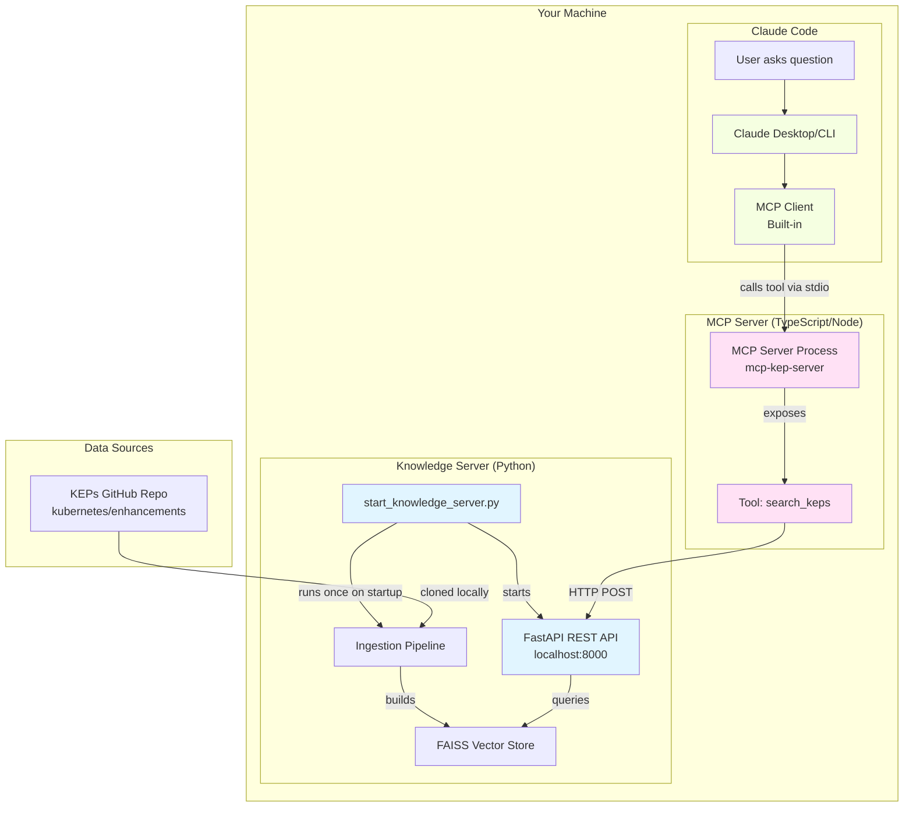

# High-Level Plan: KEP Knowledge Server with MCP Integration

## Architecture Overview

This project consists of **two separate systems** that work together:



### Component Breakdown

#### 1️⃣ Knowledge Server (Python Backend) - **BUILD THIS FIRST**
- **What:** Standalone FastAPI service
- **Purpose:** Ingest, index, and search KEP documents
- **Technology:** Python, FastAPI, FAISS, sentence-transformers
- **API:** REST endpoints on `localhost:8000`
- **Reusability:** Can be used by any tool (MCP, CLI, M365 Copilot, etc.)

#### 2️⃣ MCP Server (TypeScript Wrapper) - **BUILD THIS SECOND**
- **What:** Thin adapter implementing Model Context Protocol
- **Purpose:** Translate between Claude Code and your Knowledge Server
- **Technology:** TypeScript/Node.js
- **Communication:** stdio with Claude Code, HTTP with Knowledge Server
- **Size:** ~50-100 lines of code

#### 3️⃣ MCP Client (Built into Claude Code) - **YOU DON'T BUILD THIS**
- **What:** Built-in component of Claude Code/Claude Desktop
- **Purpose:** Manages MCP servers and makes tools available to Claude
- **Configuration:** You only provide JSON config telling it how to start your MCP server

### The Complete Flow

```
1. User asks: "How does Kubernetes handle CRD versioning?"
   ↓
2. Claude Code (with built-in MCP client) thinks: "I should search the KEPs"
   ↓
3. MCP Client calls the search_keps tool in your MCP Server (via stdio)
   ↓
4. Your MCP Server receives the tool call
   ↓
5. MCP Server makes HTTP request to Knowledge Server:
   POST http://localhost:8000/search
   { "query": "CRD versioning", "top_k": 5 }
   ↓
6. Knowledge Server (FastAPI):
   - Embeds the query using MiniLM-L6-v2
   - Searches FAISS index
   - Returns relevant KEP chunks with metadata
   ↓
7. MCP Server forwards results back to Claude Code
   ↓
8. Claude Code uses the context to answer the user with specific KEP references
```

---

## Phase 1: Project Setup & Dependencies (Knowledge Server)

### 1.1 Initialize Project Structure
```
kep-knowledge-server/
├── docker-compose.yml
├── requirements.txt
├── .gitignore
├── README.md
├── start_knowledge_server.py          # Main entry point
├── config.py                           # Configuration constants
├── ingestion/
│   ├── __init__.py
│   ├── document_loader.py              # Walks KEPs repo, loads files
│   ├── text_extractor.py               # Extracts text from .md, .yaml, .txt
│   ├── chunker.py                      # Chunks documents intelligently
│   └── embedder.py                     # MiniLM-L6-v2 wrapper
├── vector_store/
│   ├── __init__.py
│   └── faiss_store.py                  # FAISS index management
├── api/
│   ├── __init__.py
│   ├── server.py                       # FastAPI app
│   └── models.py                       # Pydantic request/response models
├── data/
│   └── enhancements/                   # Clone KEPs here
└── storage/
    ├── faiss_index/                    # Persisted FAISS index
    └── metadata.json                   # Document metadata store
```

### 1.2 Dependencies (requirements.txt)
```
fastapi==0.104.1
uvicorn==0.24.0
sentence-transformers==2.2.2
faiss-cpu==1.7.4
numpy==1.24.3
pydantic==2.5.0
python-multipart==0.0.6
pyyaml==6.0.1
markdown==3.5.1
aiofiles==23.2.1
gitpython==3.1.40
```

### 1.3 Data Source
Clone the Kubernetes Enhancement Proposals repository:
```bash
git clone https://github.com/kubernetes/enhancements.git data/enhancements
```

**Why KEPs?**
- Directory-per-ID structure matches your real use case
- Multiple formats (markdown, yaml, images)
- Realistic technical architecture content
- Good size for testing (~hundreds of documents)

---

## Phase 2: Configuration & Constants

### 2.1 config.py
Define all configuration in one place:

```python
from pathlib import Path

# Paths
BASE_DIR = Path(__file__).parent
DATA_DIR = BASE_DIR / "data" / "enhancements"
STORAGE_DIR = BASE_DIR / "storage"
FAISS_INDEX_DIR = STORAGE_DIR / "faiss_index"
METADATA_PATH = STORAGE_DIR / "metadata.json"

# Model Configuration
EMBEDDING_MODEL = "sentence-transformers/all-MiniLM-L6-v2"
EMBEDDING_DIMENSION = 384  # MiniLM-L6-v2 output dimension

# Chunking Configuration
CHUNK_SIZE = 512  # tokens
CHUNK_OVERLAP = 50  # tokens

# API Configuration
API_HOST = "0.0.0.0"
API_PORT = 8000

# KEPs Configuration
KEPS_REPO_URL = "https://github.com/kubernetes/enhancements.git"
KEPS_BASE_PATH = "keps"  # subdirectory within repo
SUPPORTED_FILE_TYPES = [".md", ".yaml", ".txt"]
```

---

## Phase 3: Document Ingestion Pipeline

### 3.1 document_loader.py
**Purpose:** Walk the KEPs directory structure and discover documents

**Key Classes:**
```python
from dataclasses import dataclass
from pathlib import Path
from typing import List

@dataclass
class KEPDocument:
    """Represents a single KEP document"""
    kep_id: str              # e.g., "sig-api-machinery/0001"
    file_path: Path          # Full path to file
    file_type: str           # .md, .yaml, .txt
    sig_name: str            # e.g., "sig-api-machinery"
    kep_number: str          # e.g., "0001"
    title: str               # Extracted from file if possible
    file_size: int           # Size in bytes
```

**Key Functions:**
```python
def discover_keps(base_path: Path) -> List[KEPDocument]:
    """
    Walk through keps/ directory structure
    
    Expected structure:
    keps/
      sig-api-machinery/
        0001-component-config/
          README.md
          kep.yaml
      sig-apps/
        0002-cron-jobs/
          README.md
    
    Returns:
        List of KEPDocument objects with extracted metadata
    """
    
def extract_title_from_file(file_path: Path, file_type: str) -> str:
    """
    Extract title from document:
    - For .md: First # heading
    - For .yaml: Look for 'title' field
    - For .txt: First non-empty line
    """
```

### 3.2 text_extractor.py
**Purpose:** Extract clean text from different file formats

**Key Functions:**
```python
def extract_text(file_path: Path, file_type: str) -> str:
    """
    Extract text content from various file types
    
    Strategies:
    - .md: Read as markdown, preserve structure (headers, lists)
    - .yaml: Convert to readable text format (key: value pairs)
    - .txt: Read as-is with encoding detection
    
    Handles:
    - Encoding issues (try utf-8, then latin-1, then ignore errors)
    - Binary files (skip)
    - Empty files (return empty string)
    
    Returns:
        Clean text string ready for chunking
    """

def clean_markdown(text: str) -> str:
    """
    Light cleaning of markdown:
    - Remove excessive whitespace
    - Normalize line endings
    - Keep headers and structure intact
    """

def yaml_to_text(yaml_content: dict) -> str:
    """
    Convert YAML structure to readable text
    Example:
    {
      "title": "Component Config",
      "status": "implemented"
    }
    →
    "Title: Component Config
     Status: implemented"
    """
```

### 3.3 chunker.py
**Purpose:** Split documents into semantically meaningful chunks

**Key Classes:**
```python
@dataclass
class Chunk:
    """Represents a chunk of text with metadata"""
    chunk_id: str            # Unique ID: {kep_id}_{chunk_index}
    text: str                # The actual text content
    kep_id: str              # Parent KEP ID
    chunk_index: int         # Position in document (0-indexed)
    metadata: dict           # All KEP metadata (sig_name, title, etc.)
```

**Key Functions:**
```python
def chunk_document(
    text: str, 
    doc_metadata: dict, 
    chunk_size: int = 512, 
    overlap: int = 50
) -> List[Chunk]:
    """
    Split document into overlapping chunks with smart boundaries
    
    Strategy:
    1. Split on markdown headers first (##, ###, ####)
       - Each section becomes a candidate chunk
    2. If sections too large, split on paragraph breaks (\n\n)
    3. If still too large, split on sentence boundaries
    4. Add overlap between chunks to maintain context
    
    Why overlap?
    - Prevents losing context at boundaries
    - Example: If chunk 1 ends mid-concept, chunk 2 starts with overlap
    
    Returns:
        List of Chunk objects with metadata preserved
    """

def split_by_headers(text: str) -> List[str]:
    """Split markdown by headers, keeping header with content"""

def split_by_paragraphs(text: str, max_size: int) -> List[str]:
    """Split on paragraph breaks if sections too large"""

def split_by_sentences(text: str, max_size: int) -> List[str]:
    """Final fallback: split on sentence boundaries"""

def add_overlap(chunks: List[str], overlap: int) -> List[str]:
    """Add overlapping text between consecutive chunks"""
```

### 3.4 embedder.py
**Purpose:** Generate embeddings using all-MiniLM-L6-v2

**Key Classes:**
```python
from sentence_transformers import SentenceTransformer
import numpy as np

class Embedder:
    """Wrapper around sentence-transformers for generating embeddings"""
    
    def __init__(self, model_name: str = "all-MiniLM-L6-v2"):
        """
        Initialize the embedding model
        
        all-MiniLM-L6-v2:
        - 384 dimensions
        - ~80MB model size
        - Fast inference (~5ms per sentence on CPU)
        - Good balance of speed and quality
        """
        print(f"Loading embedding model: {model_name}")
        self.model = SentenceTransformer(model_name)
        self.dimension = self.model.get_sentence_embedding_dimension()
    
    def embed_batch(
        self, 
        texts: List[str], 
        batch_size: int = 32,
        show_progress: bool = True
    ) -> np.ndarray:
        """
        Embed multiple texts in batches
        
        Args:
            texts: List of text strings to embed
            batch_size: Number of texts to process at once
            show_progress: Show progress bar
            
        Returns:
            numpy array of shape (len(texts), 384)
            
        Performance notes:
        - Batching is ~10x faster than one-by-one
        - Adjust batch_size based on available RAM
        - Progress bar uses tqdm
        """
        embeddings = self.model.encode(
            texts,
            batch_size=batch_size,
            show_progress_bar=show_progress,
            convert_to_numpy=True
        )
        return embeddings
    
    def embed_query(self, query: str) -> np.ndarray:
        """
        Embed a single query string
        
        Returns:
            numpy array of shape (384,)
        """
        embedding = self.model.encode(query, convert_to_numpy=True)
        return embedding
```

---

## Phase 4: Vector Store with FAISS

### 4.1 faiss_store.py
**Purpose:** Manage FAISS index for fast similarity search

**Key Classes:**
```python
import faiss
import json
import numpy as np
from typing import List, Dict
from dataclasses import asdict

@dataclass
class SearchResult:
    """Result from a similarity search"""
    chunk_id: str
    kep_id: str
    text: str
    score: float             # Cosine similarity score (0-1)
    metadata: dict           # All KEP metadata
    chunk_index: int         # Position in original document

class FAISSStore:
    """
    Manages FAISS index and chunk metadata
    
    FAISS (Facebook AI Similarity Search):
    - Fast vector similarity search
    - IndexFlatIP for inner product (cosine similarity)
    - Can handle millions of vectors efficiently
    """
    
    def __init__(self, dimension: int = 384):
        """
        Initialize FAISS index
        
        Using IndexFlatIP (Inner Product):
        - Exact search (no approximation)
        - Works well for <1M vectors
        - For larger datasets, use IndexIVFFlat
        
        Note: Inner product with normalized vectors = cosine similarity
        """
        self.dimension = dimension
        self.index = faiss.IndexFlatIP(dimension)
        self.chunks: List[Chunk] = []
        self.chunk_map: Dict[str, int] = {}  # chunk_id -> index
        
    def add_embeddings(self, embeddings: np.ndarray, chunks: List[Chunk]):
        """
        Add embeddings to FAISS index
        
        Args:
            embeddings: numpy array of shape (n, 384)
            chunks: List of Chunk objects (same length as embeddings)
            
        Process:
        1. Normalize embeddings (for cosine similarity)
        2. Add to FAISS index
        3. Store chunk metadata separately (FAISS only stores vectors)
        """
        # Normalize for cosine similarity
        faiss.normalize_L2(embeddings)
        
        # Add to index
        self.index.add(embeddings)
        
        # Store chunks and create lookup map
        start_idx = len(self.chunks)
        self.chunks.extend(chunks)
        for i, chunk in enumerate(chunks):
            self.chunk_map[chunk.chunk_id] = start_idx + i
    
    def search(
        self, 
        query_embedding: np.ndarray, 
        top_k: int = 5,
        min_score: float = 0.0
    ) -> List[SearchResult]:
        """
        Search for most similar chunks
        
        Args:
            query_embedding: numpy array of shape (384,)
            top_k: Number of results to return
            min_score: Minimum similarity score (0-1)
            
        Returns:
            List of SearchResult objects, sorted by score (descending)
            
        Process:
        1. Normalize query embedding
        2. Search FAISS index
        3. Filter by min_score
        4. Attach chunk metadata
        """
        # Normalize query
        query_embedding = query_embedding.reshape(1, -1).astype('float32')
        faiss.normalize_L2(query_embedding)
        
        # Search
        scores, indices = self.index.search(query_embedding, top_k)
        
        # Build results
        results = []
        for score, idx in zip(scores[0], indices[0]):
            if score < min_score:
                continue
                
            chunk = self.chunks[idx]
            results.append(SearchResult(
                chunk_id=chunk.chunk_id,
                kep_id=chunk.kep_id,
                text=chunk.text,
                score=float(score),
                metadata=chunk.metadata,
                chunk_index=chunk.chunk_index
            ))
        
        return results
    
    def save(self, index_path: Path, metadata_path: Path):
        """
        Persist index and metadata to disk
        
        Saves:
        - FAISS index (binary format)
        - Chunk metadata (JSON)
        """
        index_path.parent.mkdir(parents=True, exist_ok=True)
        metadata_path.parent.mkdir(parents=True, exist_ok=True)
        
        # Save FAISS index
        faiss.write_index(self.index, str(index_path))
        
        # Save metadata
        metadata = {
            'chunks': [asdict(chunk) for chunk in self.chunks],
            'chunk_map': self.chunk_map,
            'dimension': self.dimension
        }
        with open(metadata_path, 'w') as f:
            json.dump(metadata, f, indent=2)
    
    def load(self, index_path: Path, metadata_path: Path):
        """
        Load previously saved index and metadata
        
        Allows fast restart without re-ingestion
        """
        # Load FAISS index
        self.index = faiss.read_index(str(index_path))
        
        # Load metadata
        with open(metadata_path, 'r') as f:
            metadata = json.load(f)
        
        self.chunks = [Chunk(**chunk_dict) for chunk_dict in metadata['chunks']]
        self.chunk_map = metadata['chunk_map']
        self.dimension = metadata['dimension']
    
    def get_stats(self) -> dict:
        """Return statistics about the index"""
        return {
            'total_chunks': len(self.chunks),
            'total_vectors': self.index.ntotal,
            'dimension': self.dimension,
            'unique_keps': len(set(chunk.kep_id for chunk in self.chunks))
        }
```

---

## Phase 5: REST API with FastAPI

### 5.1 models.py
**Purpose:** Pydantic models for request/response validation

```python
from pydantic import BaseModel, Field
from typing import List, Optional

class SearchRequest(BaseModel):
    """Request model for search endpoint"""
    query: str = Field(..., description="Search query text")
    top_k: int = Field(5, ge=1, le=50, description="Number of results to return")
    min_score: float = Field(0.0, ge=0.0, le=1.0, description="Minimum similarity score")
    
    class Config:
        json_schema_extra = {
            "example": {
                "query": "How does Kubernetes handle CRD versioning?",
                "top_k": 5,
                "min_score": 0.3
            }
        }

class SearchResultModel(BaseModel):
    """Single search result"""
    chunk_id: str
    kep_id: str
    text: str
    score: float
    metadata: dict
    chunk_index: int

class SearchResponse(BaseModel):
    """Response model for search endpoint"""
    results: List[SearchResultModel]
    query: str
    total_results: int
    search_time_ms: float

class HealthResponse(BaseModel):
    """Response model for health check"""
    status: str
    indexed_documents: int
    indexed_chunks: int
    model_loaded: bool

class StatsResponse(BaseModel):
    """Response model for statistics"""
    total_keps: int
    total_chunks: int
    total_vectors: int
    embedding_model: str
    embedding_dimension: int
```

### 5.2 server.py
**Purpose:** FastAPI application

```python
from fastapi import FastAPI, HTTPException
from fastapi.middleware.cors import CORSMiddleware
import time
from typing import Optional

from .models import (
    SearchRequest, SearchResponse, SearchResultModel,
    HealthResponse, StatsResponse
)
from vector_store.faiss_store import FAISSStore
from ingestion.embedder import Embedder
import config

# Initialize FastAPI app
app = FastAPI(
    title="KEP Knowledge Server",
    description="Semantic search over Kubernetes Enhancement Proposals",
    version="1.0.0"
)

# Add CORS middleware (for web UI if you build one)
app.add_middleware(
    CORSMiddleware,
    allow_origins=["*"],
    allow_credentials=True,
    allow_methods=["*"],
    allow_headers=["*"],
)

# Global state (initialized on startup)
vector_store: Optional[FAISSStore] = None
embedder: Optional[Embedder] = None

def set_globals(store: FAISSStore, emb: Embedder):
    """Called from main.py to inject dependencies"""
    global vector_store, embedder
    vector_store = store
    embedder = emb

@app.get("/", tags=["root"])
async def root():
    """Root endpoint"""
    return {
        "message": "KEP Knowledge Server",
        "endpoints": {
            "search": "POST /search",
            "health": "GET /health",
            "stats": "GET /stats"
        }
    }

@app.post("/search", response_model=SearchResponse, tags=["search"])
async def search(request: SearchRequest):
    """
    Search for relevant KEP chunks using semantic similarity
    
    Process:
    1. Embed the query using MiniLM-L6-v2
    2. Search FAISS index for similar vectors
    3. Return top_k results with metadata
    """
    if vector_store is None or embedder is None:
        raise HTTPException(status_code=503, detail="Server not ready. Index not loaded.")
    
    try:
        # Start timer
        start_time = time.time()
        
        # Embed query
        query_embedding = embedder.embed_query(request.query)
        
        # Search
        results = vector_store.search(
            query_embedding,
            top_k=request.top_k,
            min_score=request.min_score
        )
        
        # Calculate search time
        search_time_ms = (time.time() - start_time) * 1000
        
        # Convert to response model
        result_models = [
            SearchResultModel(
                chunk_id=r.chunk_id,
                kep_id=r.kep_id,
                text=r.text,
                score=r.score,
                metadata=r.metadata,
                chunk_index=r.chunk_index
            )
            for r in results
        ]
        
        return SearchResponse(
            results=result_models,
            query=request.query,
            total_results=len(result_models),
            search_time_ms=search_time_ms
        )
        
    except Exception as e:
        raise HTTPException(status_code=500, detail=f"Search failed: {str(e)}")

@app.get("/health", response_model=HealthResponse, tags=["monitoring"])
async def health():
    """
    Health check endpoint
    
    Returns:
    - Server status
    - Number of indexed documents
    - Model loaded status
    """
    if vector_store is None or embedder is None:
        return HealthResponse(
            status="starting",
            indexed_documents=0,
            indexed_chunks=0,
            model_loaded=False
        )
    
    stats = vector_store.get_stats()
    
    return HealthResponse(
        status="healthy",
        indexed_documents=stats['unique_keps'],
        indexed_chunks=stats['total_chunks'],
        model_loaded=True
    )

@app.get("/stats", response_model=StatsResponse, tags=["monitoring"])
async def stats():
    """
    Get detailed statistics about the index
    """
    if vector_store is None or embedder is None:
        raise HTTPException(status_code=503, detail="Server not ready")
    
    store_stats = vector_store.get_stats()
    
    return StatsResponse(
        total_keps=store_stats['unique_keps'],
        total_chunks=store_stats['total_chunks'],
        total_vectors=store_stats['total_vectors'],
        embedding_model=config.EMBEDDING_MODEL,
        embedding_dimension=config.EMBEDDING_DIMENSION
    )
```

---

## Phase 6: Main Orchestration

### 6.1 start_knowledge_server.py
**Purpose:** Main entry point that coordinates everything

```python
#!/usr/bin/env python3
"""
KEP Knowledge Server - Main Entry Point

This script:
1. Checks if KEPs repo exists (clones if needed)
2. Checks if FAISS index exists:
   - If yes: Load existing index (fast startup)
   - If no: Run full ingestion pipeline (slow first run)
3. Start FastAPI server

Usage:
    python start_knowledge_server.py              # Normal startup
    python start_knowledge_server.py --reindex    # Force re-ingestion
"""

import asyncio
import argparse
from pathlib import Path
import uvicorn
import sys

import config
from ingestion.document_loader import discover_keps
from ingestion.text_extractor import extract_text
from ingestion.chunker import chunk_document
from ingestion.embedder import Embedder
from vector_store.faiss_store import FAISSStore
from api.server import app, set_globals


def clone_keps_repo():
    """Clone KEPs repository if it doesn't exist"""
    if config.DATA_DIR.exists():
        print(f"✓ KEPs repo found at {config.DATA_DIR}")
        return
    
    print(f"📥 Cloning KEPs repository...")
    print(f"   From: {config.KEPS_REPO_URL}")
    print(f"   To: {config.DATA_DIR}")
    
    import git
    try:
        git.Repo.clone_from(config.KEPS_REPO_URL, config.DATA_DIR)
        print("✓ Clone complete")
    except Exception as e:
        print(f"❌ Failed to clone repository: {e}")
        sys.exit(1)


def ingest_and_index() -> tuple[FAISSStore, Embedder]:
    """
    Complete ingestion pipeline
    
    Steps:
    1. Discover all KEP documents
    2. Extract text from each document
    3. Chunk documents into smaller pieces
    4. Generate embeddings for all chunks
    5. Build FAISS index
    6. Save index to disk
    
    Returns:
        Tuple of (FAISSStore, Embedder)
    """
    print("\n" + "="*60)
    print("🚀 Starting KEP Knowledge Server Ingestion Pipeline")
    print("="*60 + "\n")
    
    # Step 1: Discover documents
    print("📂 Step 1/5: Discovering KEP documents...")
    keps_path = config.DATA_DIR / config.KEPS_BASE_PATH
    if not keps_path.exists():
        print(f"❌ KEPs path not found: {keps_path}")
        sys.exit(1)
    
    documents = discover_keps(keps_path)
    print(f"   ✓ Found {len(documents)} documents")
    print(f"   ✓ SIGs: {len(set(doc.sig_name for doc in documents))}")
    
    # Step 2: Extract and chunk text
    print("\n📝 Step 2/5: Extracting and chunking text...")
    all_chunks = []
    failed_docs = 0
    
    for i, doc in enumerate(documents):
        if (i + 1) % 50 == 0:
            print(f"   Progress: {i+1}/{len(documents)} documents processed")
        
        try:
            # Extract text
            text = extract_text(doc.file_path, doc.file_type)
            if not text or len(text) < 50:  # Skip very short/empty docs
                continue
            
            # Chunk document
            doc_metadata = {
                'kep_id': doc.kep_id,
                'sig_name': doc.sig_name,
                'kep_number': doc.kep_number,
                'title': doc.title,
                'file_path': str(doc.file_path),
                'file_type': doc.file_type
            }
            chunks = chunk_document(text, doc_metadata)
            all_chunks.extend(chunks)
            
        except Exception as e:
            print(f"   ⚠ Failed to process {doc.kep_id}: {e}")
            failed_docs += 1
            continue
    
    print(f"   ✓ Created {len(all_chunks)} chunks")
    print(f"   ✓ Average chunks per document: {len(all_chunks) / len(documents):.1f}")
    if failed_docs > 0:
        print(f"   ⚠ Failed to process {failed_docs} documents")
    
    # Step 3: Initialize embedder
    print("\n🧠 Step 3/5: Loading embedding model...")
    embedder = Embedder(config.EMBEDDING_MODEL)
    print(f"   ✓ Model loaded: {config.EMBEDDING_MODEL}")
    print(f"   ✓ Embedding dimension: {embedder.dimension}")
    
    # Step 4: Generate embeddings
    print("\n🔢 Step 4/5: Generating embeddings...")
    print(f"   Processing {len(all_chunks)} chunks...")
    texts = [chunk.text for chunk in all_chunks]
    embeddings = embedder.embed_batch(texts, batch_size=32, show_progress=True)
    print(f"   ✓ Generated {embeddings.shape[0]} embeddings")
    print(f"   ✓ Shape: {embeddings.shape}")
    
    # Step 5: Build FAISS index
    print("\n💾 Step 5/5: Building FAISS index...")
    vector_store = FAISSStore(dimension=embedder.dimension)
    vector_store.add_embeddings(embeddings, all_chunks)
    print(f"   ✓ Index built with {vector_store.index.ntotal} vectors")
    
    # Save to disk
    print("\n💿 Saving index to disk...")
    vector_store.save(
        config.FAISS_INDEX_DIR / "index.faiss",
        config.METADATA_PATH
    )
    print(f"   ✓ Saved to {config.STORAGE_DIR}")
    
    print("\n" + "="*60)
    print("✅ Ingestion Complete!")
    print("="*60)
    print(f"\nStatistics:")
    print(f"  • Total KEPs: {len(set(chunk.kep_id for chunk in all_chunks))}")
    print(f"  • Total chunks: {len(all_chunks)}")
    print(f"  • Total vectors: {vector_store.index.ntotal}")
    print(f"  • Index size: {(config.FAISS_INDEX_DIR / 'index.faiss').stat().st_size / 1024 / 1024:.1f} MB")
    print()
    
    return vector_store, embedder


def load_existing_index() -> tuple[FAISSStore, Embedder]:
    """
    Load previously saved index from disk
    
    Returns:
        Tuple of (FAISSStore, Embedder)
    """
    print("📦 Loading existing index from disk...")
    
    vector_store = FAISSStore(dimension=config.EMBEDDING_DIMENSION)
    vector_store.load(
        config.FAISS_INDEX_DIR / "index.faiss",
        config.METADATA_PATH
    )
    
    embedder = Embedder(config.EMBEDDING_MODEL)
    
    stats = vector_store.get_stats()
    print(f"   ✓ Loaded {stats['total_vectors']} vectors")
    print(f"   ✓ {stats['unique_keps']} unique KEPs")
    print(f"   ✓ {stats['total_chunks']} chunks")
    
    return vector_store, embedder


def start_api_server(vector_store: FAISSStore, embedder: Embedder):
    """
    Start the FastAPI server
    
    Args:
        vector_store: Loaded FAISS store
        embedder: Loaded embedder
    """
    print("\n" + "="*60)
    print("🌐 Starting API Server")
    print("="*60)
    
    # Inject dependencies into FastAPI app
    set_globals(vector_store, embedder)
    
    print(f"\n✓ Server will start on {config.API_HOST}:{config.API_PORT}")
    print(f"\nEndpoints:")
    print(f"  • POST http://localhost:{config.API_PORT}/search")
    print(f"  • GET  http://localhost:{config.API_PORT}/health")
    print(f"  • GET  http://localhost:{config.API_PORT}/stats")
    print(f"\nPress CTRL+C to stop the server\n")
    
    # Start uvicorn
    uvicorn.run(
        app,
        host=config.API_HOST,
        port=config.API_PORT,
        log_level="info"
    )


def main():
    """Main entry point"""
    parser = argparse.ArgumentParser(description="KEP Knowledge Server")
    parser.add_argument(
        '--reindex',
        action='store_true',
        help='Force re-ingestion even if index exists'
    )
    args = parser.parse_args()
    
    # Ensure KEPs repo exists
    clone_keps_repo()
    
    # Check if index exists
    index_exists = (
        (config.FAISS_INDEX_DIR / "index.faiss").exists() and
        config.METADATA_PATH.exists()
    )
    
    # Decide whether to load or rebuild
    if index_exists and not args.reindex:
        print("\n📦 Existing index found")
        vector_store, embedder = load_existing_index()
    else:
        if args.reindex:
            print("\n🔄 Reindex flag set, rebuilding index...")
        else:
            print("\n🏗️  No existing index found, starting fresh ingestion...")
        vector_store, embedder = ingest_and_index()
    
    # Start API server
    start_api_server(vector_store, embedder)


if __name__ == "__main__":
    main()
```

---

## Phase 7: Testing & Validation

### 7.1 Manual Testing

Start the server:
```bash
python start_knowledge_server.py
```

Expected output:
```
✓ KEPs repo found at ./data/enhancements
📦 Loading existing index from disk...
   ✓ Loaded 5432 vectors
   ✓ 156 unique KEPs
   ✓ 5432 chunks

============================================================
🌐 Starting API Server
============================================================

✓ Server will start on 0.0.0.0:8000

Endpoints:
  • POST http://localhost:8000/search
  • GET  http://localhost:8000/health
  • GET  http://localhost:8000/stats
```

### 7.2 Test Search Endpoint

```bash
curl -X POST http://localhost:8000/search \
  -H "Content-Type: application/json" \
  -d '{
    "query": "How does Kubernetes handle CRD versioning?",
    "top_k": 3
  }'
```

Expected response:
```json
{
  "results": [
    {
      "chunk_id": "sig-api-machinery/0001_5",
      "kep_id": "sig-api-machinery/0001",
      "text": "Custom Resource Definitions (CRDs) support versioning through the versions field. Each version can have its own schema and conversion webhooks enable migration between versions...",
      "score": 0.87,
      "metadata": {
        "sig_name": "sig-api-machinery",
        "kep_number": "0001",
        "title": "Component Configuration",
        "file_type": ".md"
      },
      "chunk_index": 5
    },
    {
      "chunk_id": "sig-api-machinery/0013_2",
      "kep_id": "sig-api-machinery/0013",
      "text": "Version conversion in CRDs allows API clients to interact with different versions of the same resource...",
      "score": 0.82,
      "metadata": {
        "sig_name": "sig-api-machinery",
        "kep_number": "0013",
        "title": "CRD Versioning",
        "file_type": ".md"
      },
      "chunk_index": 2
    }
  ],
  "query": "How does Kubernetes handle CRD versioning?",
  "total_results": 2,
  "search_time_ms": 45.3
}
```

### 7.3 Test Health Endpoint

```bash
curl http://localhost:8000/health
```

Expected response:
```json
{
  "status": "healthy",
  "indexed_documents": 156,
  "indexed_chunks": 5432,
  "model_loaded": true
}
```

### 7.4 Test Stats Endpoint

```bash
curl http://localhost:8000/stats
```

Expected response:
```json
{
  "total_keps": 156,
  "total_chunks": 5432,
  "total_vectors": 5432,
  "embedding_model": "sentence-transformers/all-MiniLM-L6-v2",
  "embedding_dimension": 384
}
```

---

## Phase 8: Docker Support (Optional)

### 8.1 Dockerfile

```dockerfile
FROM python:3.11-slim

WORKDIR /app

# Install git for cloning KEPs
RUN apt-get update && \
    apt-get install -y git && \
    rm -rf /var/lib/apt/lists/*

# Install Python dependencies
COPY requirements.txt .
RUN pip install --no-cache-dir -r requirements.txt

# Copy application code
COPY . .

# Create directories
RUN mkdir -p data storage/faiss_index

# Expose API port
EXPOSE 8000

# Run the server
CMD ["python", "start_knowledge_server.py"]
```

### 8.2 docker-compose.yml

```yaml
version: '3.8'

services:
  knowledge-server:
    build: .
    container_name: kep-knowledge-server
    ports:
      - "8000:8000"
    volumes:
      # Persist data between container restarts
      - ./data:/app/data
      - ./storage:/app/storage
    environment:
      - EMBEDDING_MODEL=sentence-transformers/all-MiniLM-L6-v2
      - API_HOST=0.0.0.0
      - API_PORT=8000
    restart: unless-stopped
```

### 8.3 Using Docker

```bash
# Build and start
docker-compose up -d

# View logs
docker-compose logs -f

# Stop
docker-compose down
```

---

## Phase 9: MCP Server Integration (Build After Knowledge Server Works)

Once the Knowledge Server is running and tested, you'll build a small **MCP Server** to connect it to Claude Code.

### 9.1 MCP Server Structure

```
mcp-kep-knowledge/
├── package.json
├── tsconfig.json
├── src/
│   └── index.ts              # MCP server implementation
└── build/                    # Compiled JavaScript
```

### 9.2 MCP Server Implementation (index.ts)

```typescript
#!/usr/bin/env node

import { Server } from "@modelcontextprotocol/sdk/server/index.js";
import { StdioServerTransport } from "@modelcontextprotocol/sdk/server/stdio.js";
import {
  CallToolRequestSchema,
  ListToolsRequestSchema,
} from "@modelcontextprotocol/sdk/types.js";

const KNOWLEDGE_SERVER_URL = "http://localhost:8000";

// Create MCP server
const server = new Server(
  {
    name: "kep-knowledge",
    version: "1.0.0",
  },
  {
    capabilities: {
      tools: {},
    },
  }
);

// Define available tools
server.setRequestHandler(ListToolsRequestSchema, async () => {
  return {
    tools: [
      {
        name: "search_keps",
        description: "Search Kubernetes Enhancement Proposals (KEPs) for architecture and design information. Use this when answering questions about Kubernetes design decisions, features, or architecture.",
        inputSchema: {
          type: "object",
          properties: {
            query: {
              type: "string",
              description: "The search query (e.g., 'CRD versioning', 'pod security')",
            },
            top_k: {
              type: "number",
              description: "Number of results to return (default: 5)",
              default: 5,
            },
          },
          required: ["query"],
        },
      },
    ],
  };
});

// Handle tool calls
server.setRequestHandler(CallToolRequestSchema, async (request) => {
  if (request.params.name === "search_keps") {
    const query = request.params.arguments?.query as string;
    const top_k = (request.params.arguments?.top_k as number) || 5;

    try {
      // Call Knowledge Server API
      const response = await fetch(`${KNOWLEDGE_SERVER_URL}/search`, {
        method: "POST",
        headers: {
          "Content-Type": "application/json",
        },
        body: JSON.stringify({ query, top_k }),
      });

      if (!response.ok) {
        throw new Error(`HTTP ${response.status}: ${response.statusText}`);
      }

      const data = await response.json();

      // Format results for Claude
      const formattedResults = data.results.map((result: any) => {
        return `KEP: ${result.kep_id}
Title: ${result.metadata.title}
Score: ${result.score.toFixed(2)}

${result.text}

---`;
      }).join("\n\n");

      return {
        content: [
          {
            type: "text",
            text: formattedResults || "No relevant KEPs found.",
          },
        ],
      };
    } catch (error) {
      return {
        content: [
          {
            type: "text",
            text: `Error searching KEPs: ${error}`,
          },
        ],
        isError: true,
      };
    }
  }

  throw new Error(`Unknown tool: ${request.params.name}`);
});

// Start server
async function main() {
  const transport = new StdioServerTransport();
  await server.connect(transport);
  console.error("KEP Knowledge MCP Server running on stdio");
}

main().catch((error) => {
  console.error("Fatal error:", error);
  process.exit(1);
});
```

### 9.3 package.json

```json
{
  "name": "mcp-kep-knowledge",
  "version": "1.0.0",
  "description": "MCP server for KEP knowledge search",
  "type": "module",
  "bin": {
    "mcp-kep-knowledge": "./build/index.js"
  },
  "scripts": {
    "build": "tsc",
    "prepare": "npm run build"
  },
  "dependencies": {
    "@modelcontextprotocol/sdk": "^0.5.0"
  },
  "devDependencies": {
    "@types/node": "^20.0.0",
    "typescript": "^5.3.0"
  }
}
```

### 9.4 Build and Install MCP Server

```bash
cd mcp-kep-knowledge
npm install
npm run build
npm link  # Makes it globally available
```

### 9.5 Configure Claude Code

Add to Claude Code's MCP settings (typically `~/Library/Application Support/Claude/claude_desktop_config.json` on Mac):

```json
{
  "mcpServers": {
    "kep-knowledge": {
      "command": "mcp-kep-knowledge"
    }
  }
}
```

**What this config does:**
- Tells Claude Code's built-in **MCP Client** that there's a server called "kep-knowledge"
- Tells it to start the server by running the `mcp-kep-knowledge` command
- The MCP Client manages communication via stdio

### 9.6 Test End-to-End

1. Start Knowledge Server:
   ```bash
   python start_knowledge_server.py
   ```

2. Restart Claude Code to load MCP configuration

3. Ask Claude: "How does Kubernetes handle CRD versioning?"

4. Claude should:
   - Recognize it should search KEPs
   - Call the `search_keps` tool
   - Receive relevant KEP chunks
   - Answer with specific references to KEPs

---

## Success Criteria

### Knowledge Server
- ✅ Server starts and ingests KEPs automatically on first run
- ✅ Subsequent starts load existing index (fast)
- ✅ FAISS index is built and persisted to disk
- ✅ REST API responds to search queries within 100ms
- ✅ Search results are semantically relevant
- ✅ Startup time: <30 seconds with existing index, <5 minutes for full ingestion

### MCP Server
- ✅ MCP server starts when Claude Code launches
- ✅ Tool appears in Claude's available tools
- ✅ Tool calls successfully query Knowledge Server
- ✅ Results are formatted clearly for Claude
- ✅ Claude uses context to answer questions accurately

---

## Performance Expectations

### Ingestion (First Run)
- **Time:** 3-5 minutes for ~150 KEPs
- **Disk Usage:** ~50MB for FAISS index + ~10MB metadata
- **Memory:** ~2GB during ingestion, ~500MB while running

### Search Performance
- **Query Latency:** 20-50ms for top-5 results
- **Throughput:** ~100 queries/second
- **Accuracy:** Should surface relevant KEPs in top 3 results

---

## Next Steps After Completion

1. **Test with various queries** to validate search quality
2. **Iterate on chunking strategy** if results aren't relevant
3. **Add hybrid search** (combine vector + keyword) if needed
4. **Adapt for your real data** (replace KEPs with your architecture docs)
5. **Add authentication** if exposing beyond localhost
6. **Deploy to a server** if you want persistent availability

---

## Troubleshooting Guide

### Issue: Ingestion fails with encoding errors
**Solution:** Update `text_extractor.py` to handle more encodings

### Issue: Search returns irrelevant results
**Solutions:**
- Adjust chunk size (try 256 or 1024)
- Increase overlap (try 100 tokens)
- Filter by minimum score (e.g., 0.5)

### Issue: Out of memory during embedding
**Solution:** Reduce batch size in `embedder.embed_batch()` (try 16 or 8)

### Issue: MCP server can't connect to Knowledge Server
**Solution:** Ensure Knowledge Server is running on localhost:8000

### Issue: Claude doesn't call the tool
**Solution:** 
- Check MCP config is valid JSON
- Restart Claude Code
- Make tool description more specific

---

## Repository Links

- **Kubernetes KEPs:** https://github.com/kubernetes/enhancements
- **Sentence Transformers:** https://github.com/UKPLab/sentence-transformers
- **FAISS:** https://github.com/facebookresearch/faiss
- **MCP SDK:** https://github.com/modelcontextprotocol/sdk

---

**This plan is complete and ready for implementation with Claude Code!**